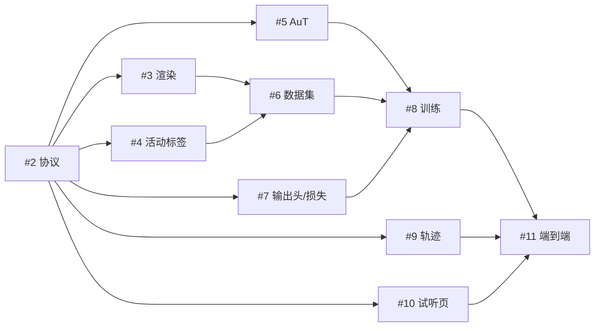

# v0 开发任务图

父任务：[Epic #1](https://github.com/guajun/anonymous-audio-tracks/issues/1)。GitHub 原生父子及 blocked-by 关系为实时状态来源；本表是初始计划，不替代重新读取 issue/PR。

| Issue | 交付 | 前置任务 |
|---|---|---|
| [#2](https://github.com/guajun/anonymous-audio-tracks/issues/2) | 协议、中心窗口与 CPU CI | 无 |
| [#3](https://github.com/guajun/anonymous-audio-tracks/issues/3) | DawDreamer 渲染与 Surge 探针 | #2 |
| [#4](https://github.com/guajun/anonymous-audio-tracks/issues/4) | 分轨中心活动标签 | #2 |
| [#5](https://github.com/guajun/anonymous-audio-tracks/issues/5) | 独立 AuT 特征与资源探针 | #2 |
| [#6](https://github.com/guajun/anonymous-audio-tracks/issues/6) | 数据集切分与多窗口采样 | #3、#4 |
| [#7](https://github.com/guajun/anonymous-audio-tracks/issues/7) | E/P 输出头与损失 | #2 |
| [#8](https://github.com/guajun/anonymous-audio-tracks/issues/8) | 最小训练、恢复与基线 | #5、#6、#7 |
| [#9](https://github.com/guajun/anonymous-audio-tracks/issues/9) | 轨迹关联与身份评估 | #2 |
| [#10](https://github.com/guajun/anonymous-audio-tracks/issues/10) | 本地音频/活动检查页 | #2 |
| [#11](https://github.com/guajun/anonymous-audio-tracks/issues/11) | 端到端与真实音乐抽查 | #8、#9、#10 |

协议合并后，六条开发线具备并行条件；默认最多运行三个本地 pi worker，GPU 任务另外排队。一个 issue 对应一个独立 worktree、分支和 PR。上游合并验收后再开始下游实现。

所有任务都给出负责目录、实施步骤、验收案例、不做事项和提交规范。AuT 权重筛选、匹配损失等研究风险由主会话协助 review，不要求 Junior 在无指导下自行猜方案。模型任务允许先用 fake features 开发，但 issue 完成时要求的真实验证不可省略。

主会话使用 [PI_ORCHESTRATION_PROMPT.md](PI_ORCHESTRATION_PROMPT.md) 调度。首次分发前必须重新运行并仔细阅读 `pi --help`。pi 执行期间不轮询，等待终端自然返回；主会话 review，pi 修订并在针对当前 HEAD 的放行后合并。

这批任务覆盖最小数据/模型/轨迹闭环与真实迁移抽查；大规模训练和正式 LED 谱面适配待结果明确后另立任务。
