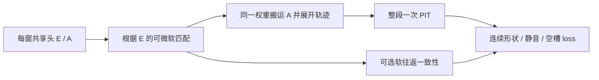

# Issue #46：关联后形状监督与 TensorBoard

本轮将侧对话确认的方案接入训练，延续 `codex/issue-46-envelope-curriculum` / PR #47。
原始 C0 结果见 [C0 报告](reports/issue-46-c0.md)，讨论总表见 [设计](ISSUE_46_DESIGN.md)。
本轮 C1 是接线和机制诊断，不意味着原来 C0 的误报/时序联合门限已经通过。

2026-10-04 后续实现已改为首个有效片段直接锚定、有限非零端点分布和独立轨迹碎片，
见 [最新局部关联定义](ENVELOPE_LOCAL_ASSOCIATION.md) 与 [新实验报告](reports/issue-46-endpoint.md)。
下文保留早期原型机制/参数作为历史说明；复现旧实验必须显式设置
`--association-backend legacy --magnitude-gate 0`。项目目标定义引用 [#48](https://github.com/guajun/anonymous-audio-tracks/issues/48)。

## 训练链的明确边界

原 C0 没有可学习 Query，但仍有 8 个固定候选输出通道，直接对通道曲线做整段 PIT。
没有调用 E 跨窗匹配，因此只能验证包络拟合。无 Query 不会自动消除通道绑定偏置。
候选容量可以固定；语义轨迹编号通过关联建立，每窗候选顺序可以不同。



主 shape 必须沿 `tracked_A → transport → E` 回传；中途不 detach E，也不以 argmax/硬索引替代配对。
末端整段 PIT 可保持离散最优求解，选中损失仍可沿前面的软关联求导。
并列最优映射对称平均；不能逐帧重配参考来源来隐藏换轨。

PIT 是允许匿名编号置换的目标；匈牙利是求离散一对一分配的算法。
当前小 K 的精确排列求解起到相同的末端分配作用；不因此称跨窗关联已可微。
推理可以另设硬匹配，但训练若仅有硬选配，无法经配对决定把包络错误反传到 E。

## 新关联器与生命周期

早期实验使用 `aat.envelopes.association.rollout`；早期 `models.associate_soft` 仅保留作旧原型探针，
不是新训练路径。新配置默认 temperature=0.1、similarity gate=0.5、Sinkhorn 12 次迭代。

- K 个匿名轨迹容量与一个 dustbin 行/列，使候选和记忆可不匹配。每轨迹的行容量精确归一为 1；
  有限迭代的列容量只是近似，实时报告最大 capacity residual，不能声称等同硬一对一置换。
- 第一窗 E 提供匿名的未可信种子，初始顺序只定义可由整段 PIT 置换的行编号。
  不额外引入学习 Query。空闲行通过软证据获得可信度，属于有限容量的 soft birth。
- 匹配使用连续可见性，避免头部初始 A 很小时被硬活动门限封死梯度。
  记忆写入要求超过 0.002 RMS 的证据，并用匹配确定性减弱混合原型更新。
- 精确静音候选不覆盖最后原型。默认 400 个无可信证据帧后回到未可信种子（40 ms 网格约 16 秒），
  释放该行的可信状态。它不是不限数量、任意长曲的完整在线出生/死亡追踪器。

初始静音种子和低置信度行的出生仍是研究局限，需靠重现/休止及随机候选顺序检查。
有限容量、空匹配或可微性本身都不能保证关联正确；不得从 C0 推断不同来源已经解耦。

### 已知问题：旧 E 与新上下文之间的证据断裂（2026-10-04）

原型缓存和第一窗种子目前没有强制其生成窗口与新候选窗口重叠。
把静音 E 或旧事件 E 与不相交的新事件 E 比较，隐含了跨上下文不变性，超过本设计的局部可匹配性。
旧 C1 的同来源重现间隔约 5.6 秒，而每次输入仅 2 秒；180 个训练中心包含重现，
不等于生成单次 E 的输入同时看见这些事件。末端 PIT 无法补足上游缺失的证据。
历史 E 漂移仅描述这种比较的结果，不能单独证明描述子模型失败。

新 `prepare-c1-local` 对 train/val/test 的全部评分中心验证同来源 note 共现，
cache 再按实际送入模型的窗口重验。保持关联器不变，先隔离数据可用证据这一变量。
它仍不能保证旧原型及时更新或 birth 正确；后续须单独解决剩余的种子/记忆问题。
检索旧事件并拼接音频再推理的回环方案延后，不属于本轮实现。
约束、运行命令与实测结果见 [C1-local 报告](reports/issue-46-local-context.md)。

## 独立 TimeCycle 开关

`--association soft --cycle-weight 0` 仍执行完整软关联。
cycle 通过同一描述子得分独立归一软正向/反向运输，约束条件转移往返返回率。
不能构造硬匹配的逆置换后，把自然成立的单位映射当作学习证据。
往返一致也可能对应稳定的错误配对，不替代 shape 或真实轨迹指标。

分轨监督阶段的 cycle 掩码排除：PIT 并列不可辨认、参考静音/刚出生的边界，以及同时活动、
包络接近的来源。当前近似判定为差值 <=0.001 + 0.05×较大 RMS；连续两端都需非歧义。
该掩码只影响辅助 cycle，主 shape 始终保留。它使用参考分轨，不可直接搬到纯混音自监督方案。
训练中保留整段计算图，测试验证相同前段包络之后的分岔误差能到达前段 E。

对照固定为：通道索引 + shape；soft + shape / cycle=0；同一 soft + shape + cycle。
本次小预算辅助系数取 0.001，仅是接线诊断起点，不是调优后推荐权重。
`--null-weight` 独立控制未使用/全空轨迹；`--empty-weight` 保持来源内静音项的旧入口。
null 未指定时继承 empty，旧默认目标不变。日志分别报告 shape、silence、null、cycle 与 weighted_cycle。

## C1 数据与运行入口

`prepare-c1` 使用固定 pad 和 pluck 两种素材；8 个 16 秒片段，4/2/2 划分。
每段五次交错起音，起音约 1.2/4.0/6.8/9.6/12.4 秒，带 +/-100 ms 扰动，随机从 A 或 B 开始。
两音色都重现；间隙大于素材 1.5 秒 + 最长 release 0.4 秒，仍检查实际分轨 overlap 和起音前电平。
这是两固定音色、参数/演奏保留集，尚不验证未见音色，也没有包含同时同包络后的实际音频分岔。
该分岔机制目前由数值梯度测试验证；更完整音频任务属于后续重叠阶段。

```sh
python scripts/envelope_experiment.py prepare-c1 --out runs/envelope/c1
python scripts/envelope_experiment.py cache --data runs/envelope/c1 \
  --out runs/envelope/cache-c1 --device cuda:0 --hop-seconds 0.04 --batch-windows 4

# 相同 head/seed/数据/预算；每次使用新的输出目录和 TensorBoard run 名。
python scripts/envelope_experiment.py train --cache runs/envelope/cache-c1 \
  --out runs/envelope/c1-index --steps 100 --seed 46 --families l1 \
  --segment-centers 180 --association index --cycle-weight 0 \
  --tensorboard-root runs/envelope/events --eval-every 50
python scripts/envelope_experiment.py train --cache runs/envelope/cache-c1 \
  --out runs/envelope/c1-soft0 --steps 100 --seed 46 --families l1 \
  --segment-centers 180 --association soft --cycle-weight 0 \
  --tensorboard-root runs/envelope/events --eval-every 50
python scripts/envelope_experiment.py train --cache runs/envelope/cache-c1 \
  --out runs/envelope/c1-softcycle --steps 100 --seed 46 --families l1 \
  --segment-centers 180 --association soft --cycle-weight 0.001 \
  --tensorboard-root runs/envelope/events --eval-every 50
```

缓存步长 40 ms，180 中心跨度 7.16 秒，足以容纳 A-B-A；整曲评估351个有效中心。
新的 C1 采样默认要求窗口实际包含至少三个完整的 0.002 RMS 门限活动事件，
避免把“片段足够长”误当成“确实看到重现”。过短片段报错而不静默退化。
首轮六个100步接线实验尚未强制该过滤；用 `--allow-partial-recurrence` 或记录的旧 commit 复现。
新结果/checkpoint 使用 `aat-envelope-association-sweep-v2`，历史数值保留原样。
每次最终评估增加逐窗独立随机打乱候选的验证，记录 `val_shuffled`。
`--shuffle-candidates` 也可用于训练打乱对照；使用独立 RNG，避免改变原片段采样顺序。
排列不变性不等于正确身份：如果所有轨迹都变成混合曲线，打乱检验仍可能通过。
评估仍需要整曲一次映射、来源包络误差、来源数、额外发声、重现和边界指标共同判断。

## TensorBoard 服务与日志语义

本任务本地访问：[http://127.0.0.1:26047/](http://127.0.0.1:26047/)。
服务器仅监听 loopback 127.0.0.1:26046，通过 SSH 映射到本地 loopback 26047。
服务独立于隧道运行；隧道断开后重连即可，无需重启服务或重复导入日志。
实际 SSH alias、任务目录、进程信息与导入器位于忽略的 `.local/issue46-tensorboard/`。

```sh
ssh -N -o ExitOnForwardFailure=yes -o ServerAliveInterval=30 \
  -L 127.0.0.1:26047:127.0.0.1:26046 <ssh-alias>
```

TensorBoard 2.21.0 安装在本任务隔离环境，torch 保持 2.9.1+cu128。
服务每15秒刷新，训练 SummaryWriter 每10秒刷盘，验证完成立即 flush。
服务器实际新运行把 `--tensorboard-root` 指向既有服务的 `events-v1`，每次新建子 run。
复现命令中的 `runs/envelope/events` 只是示例，需与自己启动服务的 logdir 一致。

历史48个运行/36,000训练步已一次性导入；包含 overview 共49个历史 run。
没有历史逐步 walltime，历史事件使用导入时间并明确标注；验证只有实际记录的初始/最终端点。
历史导入器不是 JSONL 持续同步器，不会自动更新新训练。

新运行实时写实际测量时间与 train 分项，保存0/50/100等实际验证测量；不补造中间评估。
同时记录匹配熵、空匹配、soft birth、容量残差、来源数误差、额外发声、起落边界和 frame F1。
周期性记录纯 shape 对 E 的梯度范数，避免把 cycle 的梯度误当成 shape 关联证据。
新版还记录 cycle 可用区域比例及 PIT 歧义比例，区分“辅助项被关闭/屏蔽”和“辅助项已收敛”。
Custom Scalars 的最终验证包络横轴是原曲毫秒，不是优化步；标签与跟踪曲线使用同一原曲时间格。
不同家族或版本的 raw loss 单位不同，不能直接按曲线绝对值排名。

实测表与失败解释见 [关联接线报告](reports/issue-46-association.md)。
