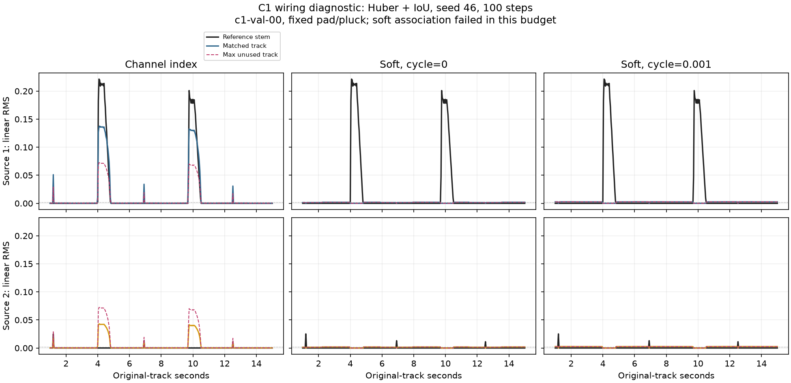

# Issue #46：关联后形状监督接线报告

日期：2026-10-03。实现仍在 `codex/issue-46-envelope-curriculum` / 草稿 PR #47。
方法、PIT/匈牙利的区分、TimeCycle 掩码和运行命令见 [关联说明](../ENVELOPE_ASSOCIATION.md)。
本报告在 [C0 实测](issue-46-c0.md) 之后验证训练接线；不宣称 C0 已通过课程晋级门限。

## 已确认的机制与当前失败

主 loss 已接到 `E → 可微部分匹配 → 搬运 A → 完整轨迹 → 整段 PIT`。
cycle=0 时软关联仍运行，真实训练中测到了纯 shape 对 E 的非零梯度。
数值测试确认后段分岔错误可到达前段 E、静音不覆盖原型、候选逐窗打乱不改变关联曲线。
这些是实现与机制证据，不是正确关联或多来源解耦的性能证据。

实际 C1 小预算中，L1 三组都收缩；Huber+IoU 的通道基线学到部分轮廓，
但两种软关联配置仍失败。匹配接近混合，TimeCycle 未挽救该设置。
更具体的探针发现：同窗候选 E 近乎一致，静音第一窗 E 与实际活动窗 E 严重漂移；
当前未可信种子、空匹配与有限容量出生逻辑尚不可靠。这是后续必须处理的问题。

## 公平对照与数据

使用两固定 pad/pluck 音色、8 个 16 秒片段，4 train / 2 val / 2 test；
随机起音 +/-100 ms、随机 A/B 开始、五次交错与重现，ADSR/gain/力度/时长变化。
实际来源 overlap ratio 全为 0，每次起音前两个来源的实测 RMS 最大值为 0。
未见音色泛化、真实重叠或实际同包络音频分岔尚未评估。

每种损失分别比较 index、soft/cycle=0、soft/cycle=0.001；
冻结骨干、8 候选共享头、183,433 训练参数、种子46、AdamW lr=3e-4和100步预算一致。
片段180中心/7.16秒；同损失组三组初始化和采样顺序相同。
soft 默认 temperature=0.1、gate=0.5、12次Sinkhorn、400帧记忆期限。
Huber delta=0.05（除以delta校准）、IoU weight=0.1、来源静音 weight=1、独立 null weight=1。
初始/第50步/第100步验证均实测；额外验证独立逐窗随机打乱候选。

训练代码为 `7973c55`。当时长片段仅保证能容纳重现，未强制每个抽样都含三个完整事件。
后续 `b5a5df0` 加入 C1 完整事件过滤，用2步服务器 smoke 验证；
该 smoke 只验证新采样与日志，不作为性能或同预算对照。
复现旧六运行用旧 commit 或当前 `--allow-partial-recurrence`。
后续产物改为 `aat-envelope-association-sweep-v2`；本报告的历史数值/版本原样保存。

全部配置、训练逐步记录、初始/中间/最终验证、测试、曲线及描述子探针见
[数值证据](evidence/issue-46-association.json)。

## 六个100步运行

IoU 对来源分别计算，再平均来源、两首验证曲；测试同样两首。
打乱检验仍在完整曲线末端做一次 PIT，不逐帧重配。
静音未使用候选超过0.002 RMS的时间比例称“额外发声”；包含参考活动时间。
漏事件是在匹配轨迹内计数，共10个验证参考事件；空槽误报另计。

| 主损失 | 训练关联 | Val IoU | Test IoU | Val 打乱 IoU | 漏事件 / 10 | 额外发声时间 |
|---|---|---:|---:|---:|---:|---:|
| L1 | index | 0.000884 | 0.001308 | 0.001111 | 10 | 0.00% |
| L1 | soft / cycle=0 | 0.001114 | 0.003390 | 0.001114 | 10 | 0.00% |
| L1 | soft / cycle=0.001 | 0.001095 | 0.002320 | 0.001095 | 10 | 0.00% |
| Huber+IoU | index | 0.357129 | 0.417193 | 0.207004 | 0 | 12.39% |
| Huber+IoU | soft / cycle=0 | 0.000074 | 0.000173 | 0.000074 | 10 | 0.00% |
| Huber+IoU | soft / cycle=0.001 | 0.000051 | 0.000117 | 0.000051 | 10 | 87.61% |

index 的 Huber+IoU 在打乱后下降，说明其有用部分依赖通道索引。
soft 打乱前后几乎一致符合排列机制，但曲线本身错误，不能将此读为成功追踪。
最后一组虽漏掉匹配来源，却让未匹配轨迹持续弱发声，来源数 MAE 达到约7.13。
仅报告匹配包络或空槽均值会遗漏这个失败。

## shape 梯度和 cycle 有效性

soft/L1/cycle=0 第1/25/50/75/100步的纯 shape 对 E 梯度范数分别为：
0.0005374、0.0004905、0.0000179、0.0000200、0.0000694。
这是通过 `autograd.grad(shape, E)` 实测，不包含 cycle 的贡献；E 没有 detach。
它证明主监督经过关联层，但不代表梯度足够好、不会收缩或已学会来源身份。

| 主损失 / 关联 | Val shape | Val silence | Val null | Val raw cycle | Val weighted cycle |
|---|---:|---:|---:|---:|---:|
| L1 / index | 0.008439 | 0.000013 | 0.000021 | 0 | 0 |
| L1 / soft0 | 0.008439 | 0.000020 | 0.000034 | 1.287189 | 0 |
| L1 / softcycle | 0.008880 | 0.000484 | 0.000458 | 1.767892 | 0.001768 |
| Huber+IoU / index | 0.066362 | 0.002448 | 0.006116 | 0 | 0 |
| Huber+IoU / soft0 | 0.107030 | 0.001607 | 0.001502 | 2.072801 | 0 |
| Huber+IoU / softcycle | 0.107065 | 0.002425 | 0.002269 | 2.104903 | 0.002105 |

soft0 的 raw cycle 仍被测量，乘以零才不进入总目标；不能把日志中的非零 raw cycle 误读为开启辅助训练。
PIT 并列或参考歧义区域会屏蔽 diagonal cycle，shape仍保留。
测试另确认“稳定但错误的对应”可以同时有低 cycle 和高 shape；往返一致不建立语义正确性。

## 描述子与空匹配诊断

以下是实际 `c1-val-00` 活动中心、最终checkpoint的只读前向探针。
同窗量为所有不同候选的平均cosine；第一窗量为第一窗种子与后续活动候选的平均cosine。
它们只描述当前模型的状态，不能直接当作一般音色相似度。

| 配置 | 同窗候选 E cosine | 第一窗→活动窗 cosine | 原始候选活动 A 均值 |
|---|---:|---:|---:|
| L1 / index | 0.999881 | 0.019105 | 0.000058 |
| L1 / soft0 | 0.997094 | 0.495958 | 0.000595 |
| L1 / softcycle | 0.999395 | -0.349329 | 0.001716 |
| Huber+IoU / index | 1.000000 | -0.976053 | 0.051320 |
| Huber+IoU / soft0 | 0.999998 | -0.994713 | 0.040660 |
| Huber+IoU / softcycle | 0.999992 | -0.980935 | 0.050793 |

Huber+IoU 的 soft0 原始候选 A 并非全部为零，但搬运后的参考轨迹仍几乎没有活动。
在当前实现中，第一窗中心尚在静音，未可信seed方向无法代表后来活动声音；
cosine漂移和门限会促使空匹配，而接近一致的同窗 E 又无法分配成不同轨迹。
日志的条件匹配熵接近 `ln(8)=2.0794` 与此一致。
这些观测支持先检查有效出生/可信初始化与混合退化，不支持先提高TimeCycle权重。

12次迭代下最大容量残差约0.23–0.24（包括K容量dustbin列）；
轨迹行容量精确，但列容量仍有近似误差。增加迭代/检查收敛需单独对照，
不能把有限Sinkhorn当成精确一对一算法，亦不能据此断定本次失败只有数值原因。

## TensorBoard 与验证

本地入口：[http://127.0.0.1:26047/](http://127.0.0.1:26047/)。
服务器loopback端口26046，通过SSH映射本地26047；实际服务信息保存在忽略的本地配置。
48个历史运行/36,000步一次性导入，新运行直接向同一logdir的新子目录写SummaryWriter事件。
历史walltime为导入时间；新事件是实际测量时间，不插值验证端点。

HTTP 200；接口读取验证 soft0/L1 的train纯shape梯度5点，val shape在0/50/100步3点。
新训练还记录shape/silence/null/cycle、匹配熵、空匹配/birth、容量残差、来源数、额外发声及边界。
最终原曲包络Custom Scalars使用毫秒时间轴；不把它与优化步混用。
新采样smoke验证0/1/2实测端点，包含cycle可用区域和PIT歧义比例。

服务器完整测试：**728 passed**，47.35秒（CPU契约进程，含实际DawDreamer集成）；GPU用于实际训练。
新增测试包括逐窗排列不变性、静音记忆、到期回收/再出生、分岔梯度到早期E、
参考歧义mask、soft cycle非平凡性、低cycle错误对应、独立null系数与完整事件采样。

C1冻结特征抽取178.15秒，峰值分配1656.26 MiB；index 100步含评估约5.2–5.5秒，
soft约143–146秒，峰值1184.17 MiB。该串行参考展开尚未优化，不能宣传为实时路径。
骨干参考前向仍执行官方decoder；本报告不提供encoder-only成本。

## 后续必须解决的问题

1. 用实际非静音证据建立可信初始轨迹，避免把静音E作为匹配门限依据；
   验证空闲容量获得新来源的机制，不把所有未可信行复制成同一混合原型。
2. 将原始候选、被搬运活动与空匹配量一起核验，防止模型把可听来源全部藏到dustbin。
   调整空匹配/birth策略需保持可微主匹配，不能以硬索引绕开E梯度。
3. 检查候选分配是否实际解耦同窗内容；允许局部同包络来源E接近，不增加无条件音色排斥来掩盖退化。
4. 在新完整重现采样下独立检查Sinkhorn收敛、初始化和权重，再跑同预算三组对照与多种子。
   该报告的单种子100步失败不证明整个研究想法不可行。
5. 后续实际同包络音频分岔、轻度overlap、TimeCycle开关和混音训练仍需分别验证；
   纯混音阶段需另设计歧义mask，不能沿用分轨参考mask。
