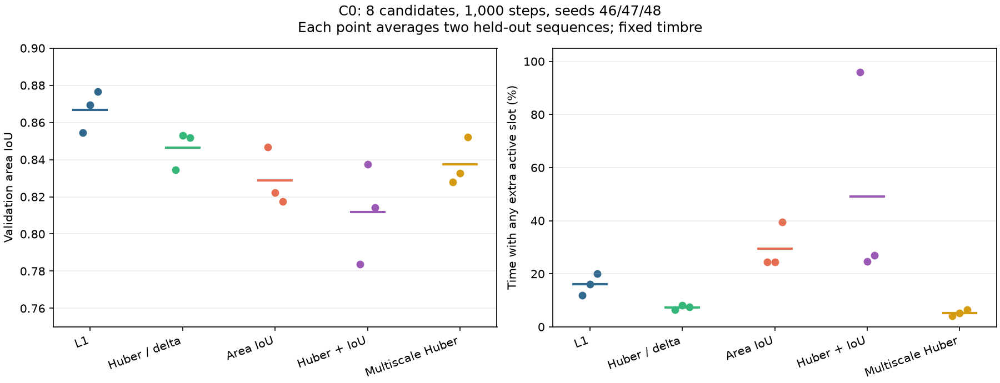
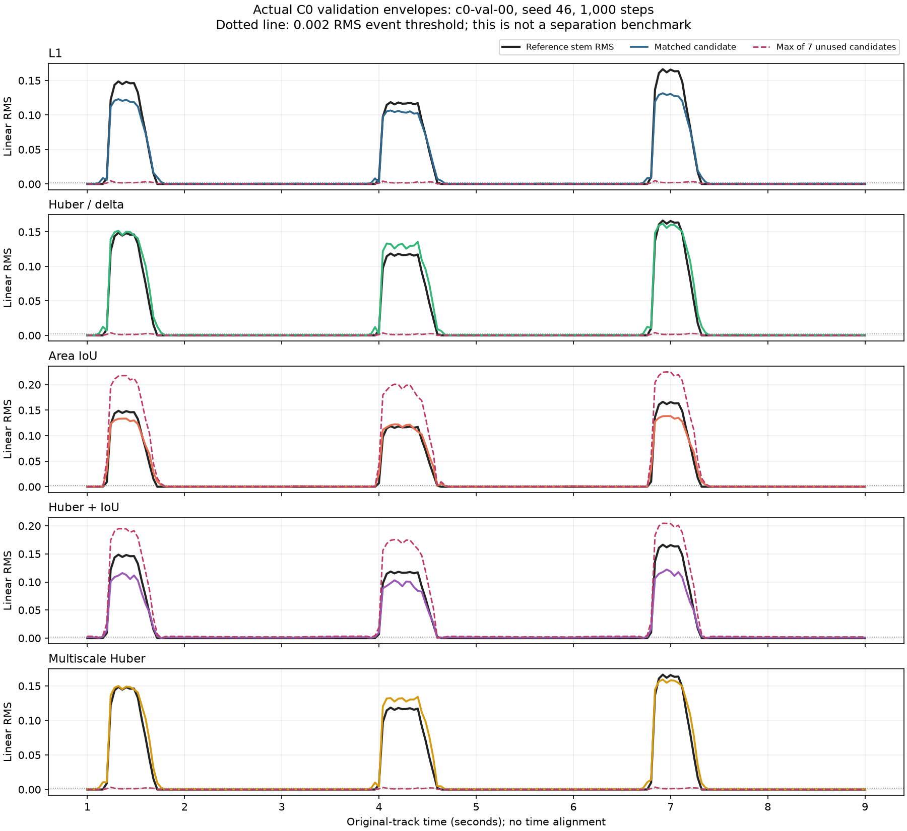

# Issue #46：C0 连续包络监督实测

日期：2026-10-03。分支：`codex/issue-46-envelope-curriculum`。
讨论与研究设计见 [ISSUE_46_DESIGN.md](../ISSUE_46_DESIGN.md)，
执行入口见 [ENVELOPE_EXPERIMENT.md](../ENVELOPE_EXPERIMENT.md)。

## 结论与适用范围

实际 DawDreamer 分轨可以提供连续 RMS 包络；冻结官方 htdemucs + 无 Query 向量头
已能在单固定音色、单来源 C0 上学习轮廓。描述子仅要求局部可匹配，TimeCycle 本轮关闭。
三种子 1,000 步实验中，L1 的验证集面积 IoU 为 0.8668，多尺度 Huber 为 0.8376；
后者额外槽位越过固定活动门限的时间更少，但二者仍有时序和空槽误差。

本轮是工程筛选，不是多来源分解或损失优劣的最终证据。数据只有 4/2/2 个训练/验证/测试片段，
全部使用同一音色、固定音高和相同三个名义起音位置，变化的是 ADSR、增益、力度与时长。
测试划分也用于逐项记录探索实验，正式结论需要另行锁定更大保留集。
单来源的混音 RMS 恰好等于目标，所有片段的该基线 MAE 都为 0；本头没有胜过这个 C0 基线。
C0 尚未验证 E 的关联能力，不自动升级到 C1。

## 讨论决定及已落地的更改

1. 核心目标是连续活动形状，E 不承担全局音色分类；相同包络的不同音色允许 E 接近。
   后续曲线分岔时，应通过可微关联后的形状误差约束匹配。TimeCycle 作为独立辅助消融。
2. 合成管线记录 ADSR 参数，但目标从实际进入混音的效果/gain 后分轨测量。
   素材本身也有包络，理论 ADSR 参数不能直接替代实际声音强度。
3. 新建 `aat-envelope-v1`、`linear_rms_full_scale` 协议，记录时间格、有效掩码、测量窗、
   来源顺序和输入/数组摘要。没有逐窗归一化，也没有将旧 probability 产物静默改成强度。
4. 增加 C0 生成、声学尾音检查、冻结 Demucs 缓存、共享卷积向量头、片段级精确 PIT、
   R0–R4 损失组合、曲线导出、起落边界及空槽活动诊断。
5. 可微 Sinkhorn 关联展开已有梯度测试；当前 C0 训练器直接比较整段槽位曲线。
   C1 必须接入关联、静音重现与分岔样本，才能评价 E，而非沿用 C0 指标作推断。

## 数据及模型参数

| 项目 | 实测或固定配置 |
|---|---|
| 语料 | 8 个 10 秒片段（8 秒演奏 + 2 秒尾部），4 train / 2 val / 2 test |
| 渲染 | DawDreamer 0.9.0 SamplerProcessor；生成的固定 pad 素材，C4 音高 |
| 变化 | attack 10/40/100/200 ms；decay 40/100/200 ms；sustain 0.35/0.6/0.9；release 100/200/400 ms 的生成选项；小语料只覆盖其中部分组合 |
| 演奏 | 起音 1.2/4.0/6.8 秒；间隔 2.8 秒；力度 65–115；note length 0.3–0.5 秒；gain 0.3–0.65 |
| 非重叠证据 | 素材 1.5 秒 + release 最长 0.4 秒 < 间隔 2.8 秒；每次起音前实测 RMS 为 0；单来源 overlap ratio=0 |
| 连续标签 | 20 ms 时间格，20 ms 中心矩形能量窗，声道等功率平均，保留原始 RMS |
| 模型输入 | 44.1 kHz 双声道；应用上下文 2 秒；只保留完整上下文中心 |
| 冻结骨干 | Demucs 4.0.1 官方单模型 `htdemucs`，41,984,456 参数 |
| 特征 | cross-transformer 输出；频域 `[B,512,8,336]`、时域 `[B,512,1344]`；拼接并裁为 `[B,1024,8,86]` |
| 缓存 | FP16，201 个中心/片段，实验输出网格 40 ms；没有重新抽取每个 loss 家族的特征 |
| 向量头 | hidden=128，E=128；8 竞争候选 + 背景，共享向量映射；训练参数 183,433 |
| 模长 | 原始向量 × 中心分配占比得到 z；`A=norm(z)/(1+norm(z))`，E 为单位方向 |
| 优化 | AdamW，lr=3e-4，weight decay=1e-4，梯度裁剪 1；连续片段 40 个中心（跨度 1.56 秒） |
| 主复核 | 每家族 1,000 更新；种子 46/47/48；同容量组内相同初始化及片段采样顺序 |
| 损失参数 | Huber delta=0.05，默认除以 delta；IoU weight=0.1；empty/silence weight=1 |
| 多尺度 | Gaussian sigma 0/20/50/100 ms，等权，保留未平滑尺度 |
| TimeCycle | 0；C0 不启用描述子关联损失 |

训练片段从含活动的连续范围取样；段内及整曲评估使用一次完整轨迹排列，包含未使用槽位代价。
8 个通道表示候选容量，没有可学习 Query 或每槽独立描述子输出层。
它仍有通道索引，不能因此保证没有固定通道偏置；后续应按曲线对应与重现评估语义身份。

官方 eval 路径会将 2 秒输入补到训练 segment 7.8 秒，并执行 decoder。
本报告的资源开销属于该参考完整前向路径，不能引用为纯 encoder 开销。
特征时间位置目前按名义 STFT bin center 映射，尚未完成脉冲/感受野边界认证。

权重 `955717e8-8726e21a.th` SHA-256：
`8726e21a993978c7ba086d3872e7608d7d5bfca646ca4aca459ffda844faa8b4`。
数据、缓存身份及完整逐片段数值见 [数值证据](evidence/issue-46-c0.json)。

## 时间偏移与面积形状损失

L1/Huber 都是同一时间点相减。面积 IoU 确实比较曲线下方的二维区域，
但并不自动得到时间平移容忍：设 `B=sum(p+y)`、`D=sum(abs(p-y))`，则
`IoU=(B-D)/(B+D)`，所以它是按面积尺度归一化的 L1 变换。

人工包络探针中，20 ms 平移的面积 IoU 为 0.8639，100 ms 为 0.5366；
质量归一化的 W1 分别为 0.020 和 0.100 秒。该探针只验证几何，不是模型性能。
多尺度回归可扩大附近曲线的重叠，但仍需未平滑的绝对时间约束。
W1+面积、有界统一平移和 Soft-DTW 留在第二批选项表，本轮没有实现或排名它们。

## 等预算 R0–R4 三种子结果

以下为 8 候选、weight=1、校准 Huber、每种子 1,000 步结果。
验证 IoU 报告种子均值 ± 总体标准差（ddof=0），每个种子先平均两首验证曲。
测试 IoU 同样平均三种子。空槽强度按七个未使用候选和时间平均。
“额外发声时间”是在整段有效网格上，至少一个空槽 RMS >=0.002 的比例，包含参考活动期间。

| Run | 主损失 | Val 面积 IoU | Test 面积 IoU | Val MAE | 空槽平均 RMS | 额外发声时间 |
|---|---|---:|---:|---:|---:|---:|
| R0 | L1 | 0.8668 ± 0.0092 | 0.8338 | 0.002675 | 0.000518 | 16.09% |
| R1 | Huber / delta | 0.8464 ± 0.0084 | 0.8369 | 0.003274 | 0.000399 | 7.38% |
| R2 | 面积 IoU | 0.8288 ± 0.0128 | 0.8405 | 0.003465 | 0.020773 | 29.44% |
| R3 | Huber / delta + 0.1 IoU | 0.8117 ± 0.0220 | 0.8394 | 0.003860 | 0.006290 | 49.17% |
| R4 | 多尺度 Huber / delta | 0.8376 ± 0.0104 | 0.8291 | 0.003468 | 0.000357 | 5.31% |



IoU 项的绝对梯度量级随目标面积变化；仅校准 Huber 的大残差斜率不意味着 IoU 权重已经调优。
纯 IoU 的有用轮廓被其他空槽重复输出，不能只看匹配到的一条曲线就认定模型成功。
R3 有一个种子的空槽几乎全时段越过门限，平均 IoU 没有充分暴露这个问题。

事件诊断使用同一个 0.002 线性 RMS 门限和原曲时间格；对有重叠事件做一对一匹配，
无重叠计为漏报，不执行平移或逐音重新对齐。只报告已匹配事件的边界误差，漏报另计。
下表为三个种子 × 两首验证曲，共 18 个参考事件；分辨率为 40 ms，弱尾音门限影响边界。

| 主损失 | 起音 MAE（ms） | 收音 MAE（ms） | 漏事件 / 18 | 额外事件（匹配轨迹内） |
|---|---:|---:|---:|---:|
| L1 | 46.67 | 48.89 | 0 | 2 |
| Huber / delta | 64.44 | 57.78 | 0 | 2 |
| 面积 IoU | 0.00 | 64.44 | 0 | 3 |
| Huber + IoU | 26.67 | 48.89 | 0 | 2 |
| 多尺度 Huber | 53.33 | 48.89 | 0 | 0 |

0 ms 仅表示该门限下的离散网格匹配，不代表物理零延迟或所有音色起音无误差。
下面保存了真实验证样本的预测，红虚线是七个未使用候选中的最大输出，便于看到复制来源的问题。



## 短预算诊断与修正证据

三个版本均为 seed=46、每家族 200 步；不能把不同头部版本混合成损失排行榜。

| 主损失 | v1：半径未绑定分配 | v2：绑定分配、原始 Huber | v2：绑定分配、Huber 校准 |
|---|---:|---:|---:|
| L1 | 0.0501 | 0.7845 | 0.7845 |
| Huber | 0.0053 | 0.0004 | 0.7953 |
| 面积 IoU | 0.7615 | 0.7773 | 0.7773 |
| Huber + IoU | 0.7598 | 0.7843 | 0.7847 |
| 多尺度 Huber | 0.0062 | 0.0004 | 0.8040 |

表中数值为验证面积 IoU。v1 共享向量映射可给低分配槽位同样大的输出，
回归项容易收缩，IoU 项容易产生多份轮廓。v2 将模长与中心分配证据相乘后，L1 明显恢复。
这次仅是工程诊断，没有三种子架构对照，不能据此作最终因果性能结论。

原始 Huber 的大残差斜率是 delta=0.05，空槽/静音 L1 是 1；未校准比较误把量级影响当作家族差异。
默认 Huber/delta（对应 SmoothL1）统一这部分大残差斜率，再按相同预算比较。
`--raw-huber` 保留原始诊断路径，checkpoint 记录具体配置。

## 候选容量和强静音惩罚对照

都使用 seeds=46/47/48、1,000 步；只运行 R0/R1/R4，分别独立记录。
K=1 无空槽指标天然为零，不是自动多来源分配能力的证据。
weight=7 同时加强空槽和来源内部的精确静音点惩罚，不是只改变空槽系数的单变量实验。

| 配置 | 主损失 | Val IoU | Test IoU | 起音 MAE（ms） | 收音 MAE（ms） | 漏事件 / 18 |
|---|---|---:|---:|---:|---:|---:|
| K=1，weight=1 | L1 | 0.8388 ± 0.0155 | 0.8123 | 40.00 | 33.33 | 0 |
| K=1，weight=1 | Huber | 0.8275 ± 0.0149 | 0.8167 | 40.00 | 35.56 | 0 |
| K=1，weight=1 | 多尺度 Huber | 0.8117 ± 0.0164 | 0.8044 | 26.67 | 26.67 | 0 |
| K=8，weight=7 | L1 | 约 0.0000 | 约 0.0000 | 未定义 | 未定义 | 18 |
| K=8，weight=7 | Huber | 约 0.0000 | 约 0.0000 | 未定义 | 未定义 | 18 |
| K=8，weight=7 | 多尺度 Huber | 约 0.0001 | 约 0.0000 | 未定义 | 未定义 | 18 |

K=1 仍有时序误差，说明仅减少候选不能解决所有偏差。
强惩罚把输出整体压到零，没有形成正确单来源分配，不能因空槽安静而判为成功。
下一轮应拆分来源内部静音项和未使用槽位项，而不是继续盲目增加同一个系数。

## 运行成本、验证及复现

使用独立 Python 3.12.11 环境和 A6000；torch/torchaudio 2.9.1+cu128。
新环境单独安装依赖，没有升级原有服务器任务环境。只使用自生成合成音频，没有传输用户音乐。
8 段冻结特征抽取约 101.24 秒，GPU 峰值分配约 1,656.26 MiB。
缓存后，主复核每个 1,000 步家族含最终评估耗时约 14.15–17.34 秒，峰值分配 316.49–317.19 MiB。
这些是短合成任务的参考开销，不包括下载安装，也不是在线端到端实时因子。

总计保存 48 个训练运行：3 个短预算版本各 5 家族；三种子主复核 15 个；
容量/惩罚诊断 18 个。checkpoint、逐步日志、冻结缓存和完整预测 NPZ 保留在独立服务器任务目录。
公开仓库保存配置、摘要、全部逐片段指标和上述验证曲线数值；不提交音频、模型权重和特征缓存。

服务器完整测试：**718 passed**，约 47.33 秒；包括真实 DawDreamer 集成。
CPU 契约测试在 `CUDA_VISIBLE_DEVICES=` 的独立进程执行，训练进程仍使用 GPU。
GPU 可见时，一个既有 CPU 资源测试的前置假设不成立；未改动该测试以掩盖环境条件。
新增测试覆盖连续幅度、摘要完整性、反相声道能量、空目标梯度、IoU 几何、整段接错、
含空槽的精确匹配、模长分配约束、Huber 斜率校准、关联回传、时间偏移与事件一对一匹配。

执行代码版本：首版 `3e3a237`；半径修正 `ae4fc88`；Huber 校准 `2838f41`；
主三种子/事件输出 `fe3d3d6`；容量/权重诊断 `e5e8101`。
每个运行完整 commit、标签/缓存 hash、参数和结果都保存在数值证据中。

```sh
python scripts/envelope_experiment.py prepare-c0 --out runs/envelope/c0 --seed 4600
python scripts/envelope_experiment.py cache --data runs/envelope/c0 \
  --out runs/envelope/cache --device cuda:0 --hop-seconds 0.04 --batch-windows 4

for seed in 46 47 48; do
  python scripts/envelope_experiment.py train --cache runs/envelope/cache \
    --out runs/envelope/main-$seed --device cuda:0 --steps 1000 --seed "$seed" \
    --slots 8 --empty-weight 1 --families l1 huber area_iou huber_iou multiscale
  python scripts/envelope_experiment.py train --cache runs/envelope/cache \
    --out runs/envelope/capacity1-$seed --device cuda:0 --steps 1000 --seed "$seed" \
    --slots 1 --families l1 huber multiscale
  python scripts/envelope_experiment.py train --cache runs/envelope/cache \
    --out runs/envelope/empty7-$seed --device cuda:0 --steps 1000 --seed "$seed" \
    --empty-weight 7 --families l1 huber multiscale
done

CUDA_VISIBLE_DEVICES= PYTHONPATH=src python -m pytest -q
# 图表仅需 numpy/matplotlib，不读取模型或音频：
python scripts/plot_envelope_report.py
```

## 下一阶段进入条件

本轮通过数据链、有限预算训练和形状监督的工程验证，尚未同时满足低空槽误报与准确时序条件。
进入 C1 前先拆分空槽/静音系数，检查 50 ms 中心池化与名义特征时间映射的影响，
恢复 20 ms 密集输出作对照，并扩大 C0 数据、随机化起音和间隙。
这些是待测试的解释，不把时间偏差直接归因于某一模块。

在更大验证集上预先声明形状、误报和边界的联合门限，避免只优化单一 IoU。
保留 L1 简单参照与 Huber/多尺度候选；IoU 权重与空槽分配需要独立校准。
之后接入 C1 双音色交错、A-B-A 重现和“相同包络后分岔”，验证关联后形状 loss 对 E 的作用。
C2/C3 再增加真实声学重叠，C4 再加入更复杂 DawDreamer 音乐结构。
混音继续训练与纯混音自监督最后分别对照，TimeCycle 仍按独立开关报告。
