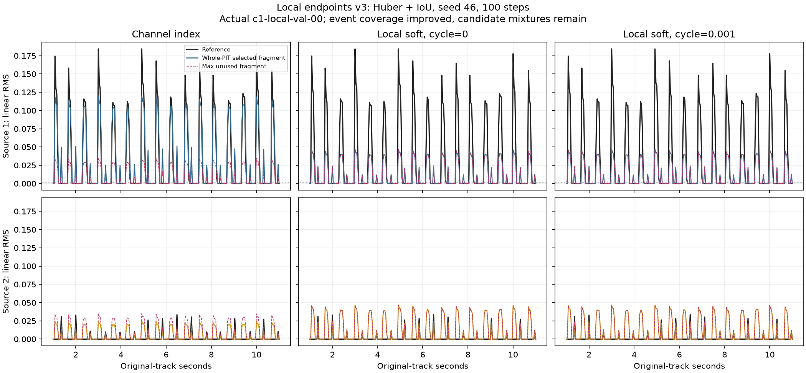
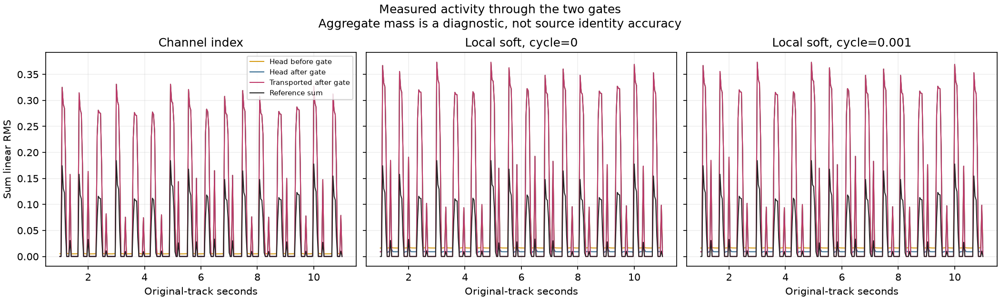
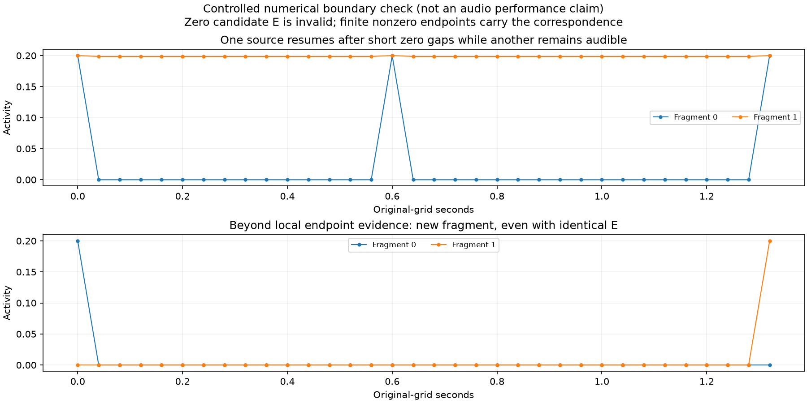

# Issue #46：直接锚定、有限端点与轨迹碎片的实测

日期：2026-10-04，研究分支 `codex/issue-46-envelope-curriculum` / 草稿 PR #47。
按 [#48，第 1..6、8 节](https://github.com/guajun/anonymous-audio-tracks/issues/48) 执行，
详细算法与局限见 [局部关联定义](../ENVELOPE_LOCAL_ASSOCIATION.md)。
本轮未修改 main 的协议文档，未实现回环或容量调度，没有 merge。

## 本轮完成与结论边界

首窗/首个有效活动直接匿名锚定，完全零首窗没有身份种子；
严格零输出的 E 无效。有限非零端点分布替代按置信度锁住的长期原型，
TimeCycle 使用相同局部端点/窗口对的独立正反向软矩阵。
门后 A 通过同一匹配权重展开成碎片曲线，整段只做一次 PIT；
超过共同证据范围就创建新的曲线列，不以 lane 重用虚接旧身份。

真实实验中，Huber+IoU/soft 已有活动输出及事件覆盖，未再出现历史“raw A 有活动而搬运活动几乎全部消失”的状态。
但曲线仍把两来源混合到重复轨迹，未达到来源解耦/正确轨迹验收。
L1 三组仍全零；关闭区间 A 的代理梯度非零，不能把这个失败描述成简单的硬门完全切断训练。
下面保存所有失败、并列与有效辅助监督范围，不用工程测试通过代替研究成功。

## 数据、公平性与版本

沿用原 `cache-c1-local-v1`，不重做数据或覆盖缓存；
8×13秒、4/2/2划分、固定 pad/pluck、18事件/source、0 overlap。
原 4,008 标签中心/2,008 实际 2 秒窗口的共现审计继续有效，评分轴为 1..11 秒。
目标是未变换的分轨连续 RMS，标签20ms，缓存/输出40ms；K=8>=实际来源数2。
不以容量解释本轮候选混合或漏识别。

骨干冻结41,984,456参数，共享无 Query 头183,433参数，E/hidden=128。
所有组合使用 seed46、100步、lr3e-4、AdamW、180中心，统一初始化和完整事件抽样过滤；
Huber/delta 的 delta=.05，IoU weight=.1，silence/null weight=1。
每组六个运行的 sample/offset 序列、缓存摘要、代码 commit、head gate 均逐项一致。

- v1 探针：commit `12cd8cd`、头部gate=.002、搬运不gate；6组全部实际执行并保留。
  微小 soft 串扰可以把其他来源作为休止 lane 的最新端点，因此未作为正式短静音实现验收。
- v2：commit `2babaab` 引入搬运gate，历史六组独立保留。
- 正式 v3：commit `89aea3f`、关联 `aat-local-endpoint-fragments-v3`，
  头部与搬运gate均为.002；cycle进一步排除零容量占位，再独立执行6组。head为`aat-envelope-vector-gated-v3`，
  result/checkpoint为`aat-envelope-local-fragments-sweep-v3`，记录关联版本与全部配置。
- 历史长期原型和未gate头保留：它们与本轮同时存在 head gate、关联更新、
  cycle端点、碎片重建/PIT归一的变化，不能把新旧性能差异全部归因于某一个修改。
- v1/v2 的单一显式配置变化是搬运gate；它也改变后续有效端点、出生与轨迹计算路径。
  两版 index 数值完全一致，不能把重复基线当两个独立随机种子。

## 正式 v3 六组100步

验证两首共64个参考事件，来源/歌曲分别平均面积IoU。
“漏事件=0”只表示所选曲线与各参考事件有门限重叠，不能证明身份或事件纯度。

| Loss | 关联 | Val IoU | Test IoU | 打乱 Val IoU | 漏事件 / 64 | 额外活动时间 | PIT最优映射数（两首val） |
|---|---|---:|---:|---:|---:|---:|---|
| L1 | index | 0 | 0 | 0 | 64 | 0% | 56, 56 |
| L1 | local soft / cycle=0 | 0 | 0 | 0 | 64 | 0% | 56, 56 |
| L1 | local soft / cycle=.001 | 0 | 0 | 0 | 64 | 0% | 56, 56 |
| Huber+IoU | index | 0.426381 | 0.384871 | 0.203657 | 0 | 34.06% | 1, 1 |
| Huber+IoU | local soft / cycle=0 | 0.213178 | 0.186358 | 0.213178 | 0 | 35.46% | 12, 12 |
| Huber+IoU | local soft / cycle=.001 | 0.213184 | 0.186362 | 0.213184 | 0 | 35.46% | 12, 12 |

index 的有效部分仍依赖通道索引；打乱后下降。
soft 打乱前后相同，但多个轨迹复制混合形状，两个来源都被拟合成相近的小幅脉冲。
Huber+IoU/soft0 的来源数MAE约2.464，全部8个碎片都有活动；
同窗有效候选平均cosine约0.999939，仅描述本次候选对称，不作为一般音色相似度。
本轮没有添加无条件音色排斥或 Query 来改变目标。

### v1 诊断历史

v1 L1三组也全零。Huber+IoU 的 index/soft0/softcycle Val IoU分别为
0.426381 / 0.203751 / 0.203752，Test为0.384871 / 0.179010 / 0.179011。
两组soft均保留约100%的头部总活动，漏事件0，额外活动约34.46%。
v2两组soft的Val为0.213178 / 0.213180，Test为0.186358 / 0.186359；
它未排除cycle容量占位，保留为第二版诊断。正式v3只更改辅助cycle有效端点集合，六组仍完整复跑。
这些是实际运行，不是推测/插值；数值和原曲曲线同正式v3一起保存在证据中。

## 门控、raw/搬运活动与梯度

在参考至少一来源活动的中心，Huber+IoU/soft0 的全部候选 raw A 均值（两首平均）约0.032985，
搬运后也是0.032985；该设置没有把这些中心的活动全部藏掉。
全曲搬运后/头部gate后总量比约0.93875，约6.13%总量被搬运gate移除，
具体每步及门前/门后均保存，不能把它报成无损运输。
null 是旧 lane 分配给当前零候选容量的量，soft0均值约0.32893；当前真实活动不流向dustbin。
soft0条件熵约1.60911；数值有定义的区间及全零熵0分开解释，不把0当完美确定性。

L1/c1-local-val-00 的头部门前均值约3.31e-5，门后为严格0，所有零候选E也严格0。
三组训练100步全部为PIT并列（56种）；soft没有有效E关联或cycle。
实际主shape+silence+null对关闭区间的门前A梯度范数，第1/25/50/75/100步约
0.04969/0.05002/0.05024/0.04973/0.04990。
因此代理A梯度确实存在，但在该预算与目标下仍收缩；E梯度为0符合“零没有身份”的语义。
下一步应独立诊断幅度开启、损失平衡及门阈值，不能单凭代理梯度非零宣称gate可训练性已经解决。

Huber+IoU/soft0 的纯shape→E梯度第1步为0（当时输出全零），
第25/50/75/100步约为2.13e-8 / 1.08e-7 / 8.19e-6 / 2.41e-4。
后续活跃区间主监督能经软匹配回传；数值分岔测试还确认后段错误能到达早期E。
这些都不证明当前形状梯度足以打破重复候选的对称。

## 局部拼接、真实碎片与cycle有效区域

有限端点距离上限严格为0.91秒，并检查两端真实输入的内侧证据边界。
在正式soft0/c1-local-val-00导出的所有有效端点对中，最大实际距离为0.36秒；
不再与10秒前静音首窗原型做身份比较。
没有 confidence/entropy 门控更新最新有效非零证据；当前有效端点每次替换，零输出不覆盖。

两首验证共60对同来源相邻事件，全部满足本轮局部证据条件。
Huber+IoU 三组在固定整段PIT所选曲线上的短间隙两端覆盖为100%，L1为0%。
这个指标只说明两端事件在同一条所选曲线上均有活动，
重复混合轨迹也可以拿到100%；必须与IoU、额外事件/候选、来源数和PIT并列一起看。
逐对原时间、局部条件、固定PIT两端覆盖以及事件最佳碎片的断裂诊断全部保存；
事件最佳碎片仅用于诊断，不逐事件改变训练或主评估映射。

C1-local本身没有真实长休止参考，本次正常整曲预测也没有端点到期，
不能把这批音频当成长间隙重连性能测试。长范围真实断轨的证据为：

1. 受控数值测试含另一来源持续发声的情形：0.6秒非零端点距离保留同一碎片，
   1.2秒后的活动不得连接回旧fragment_id；完全零间隙同样断轨。
2. 用真实cache和正式checkpoint的非零输出，另作稀疏观测诊断。
   保留原中心1.00/2.12秒及各自2秒输入，省略中间观测；两端超过0.91秒，
   旧有效ID为0/2/3/5，新有效ID为8/9/10/11，两帧直接匿名锚定、没有cycle/旧端点匹配。
   保存真实A/E、上下文边界和独立碎片曲线。这是观测缺口诊断，不等同物理长静音。

局部共同输入只是证据条件。当前中心输出接口确实能比较两端非零候选，但仍未学会可靠的来源对应；
它也没有显式输出上下文内两个事件的相同来源关系。
长休止音频性能、端点候选是否足够以及后续检索/裁剪到同窗再推理的回环，需要另立实验，不能从本轮推导成功。

正式两组Huber+IoU/soft训练各有24步PIT并列，76步有可用cycle区域。
cycle-on平均weighted_cycle约0.0015804，确实进入了训练目标；
最终两首val各有12种并列，两首test分别为12/20种并列，辅助cycle均被屏蔽为0。
因此两组最终指标几乎相同不能被解读为“充分的cycle监督没有作用”或“cycle成功”；
有效区域不足、候选对称和主shape拟合须分别诊断。

## 验证、成本与复现

正式完整服务器测试 **749 passed**，48.61秒，含实际DawDreamer集成。
本地包络测试 **52 passed**。新测试涵盖首窗自对应、零首窗、
来源零间隙/另一来源持续发声、短静音共同证据、边缘余量、长期不虚接、候选打乱、
总活动搬运、分岔梯度、cycle独立正反向、gate关闭区间梯度、碎片PIT断轨惩罚及wide PIT。
旧长期原型测试继续通过；完整日志与旧结果保留。

沿用缓存，未再次计特征抽取成本。正式index训练含评估约5.07..5.34秒；
L1/soft约10.55..10.81秒（全零没有实际匹配），Huber+IoU/soft约135.80..136.41秒，
峰值约1,188.27 MiB。骨干参考前向仍执行官方decoder，不能报为encoder-only成本。

TensorBoard入口 [本地26047](http://127.0.0.1:26047/)，v1/v2/v3共18个新run及smoke独立保留。
实测train1..100、val0/50/100、test/打乱，记录各loss项、gate前后、raw/transported、
null/熵/容量残差、PIT、有效cycle、纯shape→E及关闭区间A梯度；原曲曲线使用毫秒轴。
HTTP接口复核正式六组的100个train点、3个val点和各251个raw/transported曲线点均可读。
脚本/命令见 [局部关联定义](../ENVELOPE_LOCAL_ASSOCIATION.md)。
完整配置、逐步日志、曲线、短间隙记录、真实有限端点对和断轨诊断见
[数值证据](evidence/issue-46-endpoint.json)。

下一步仍需在同一数据上独立诊断候选混合/PIT对称、L1开启与损失平衡，
再扩大保留集和种子；正确来源轨迹、overlap课程和混音训练未通过验收。
