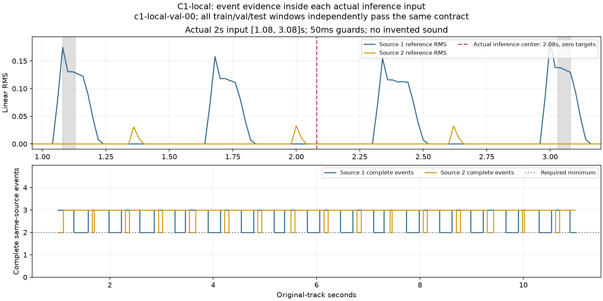
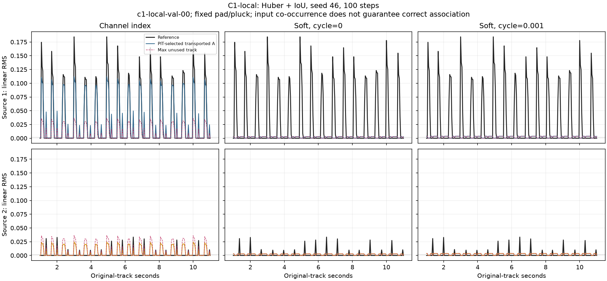
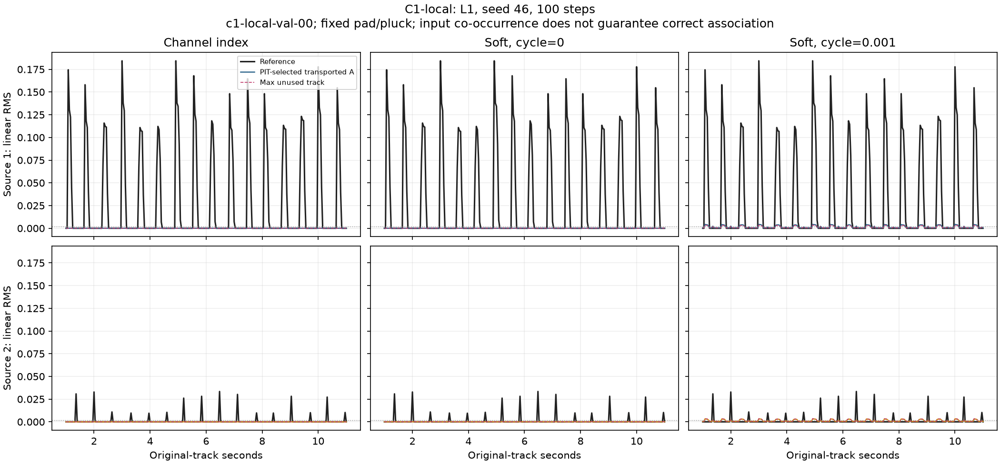
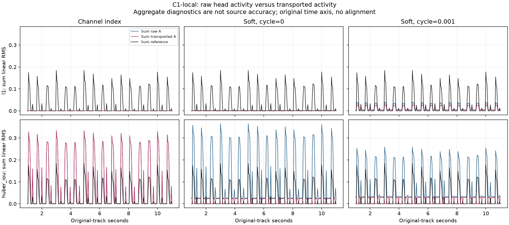

# Issue #46：实际输入共现约束与 C1-local 对照

日期：2026-10-04。分支 `codex/issue-46-envelope-curriculum`，草稿 PR #47。
本轮纠正局部 E 假设与旧数据的任务错配，保留 [旧 C1 报告](issue-46-association.md) 的数值历史。
设计边界见 [设计文档](../ISSUE_46_DESIGN.md)，上游关联与末端 PIT 的区别见
[关联说明](../ENVELOPE_ASSOCIATION.md)。

## 已知问题与本轮改变

E 只要求在连续滑窗的局部证据中可匹配，允许同活动形状的不同声音拥有接近的 E。
存储旧 E 或静音第一窗种子，再与不相交的新活动上下文比较，隐含了跨上下文不变性。
旧 C1 同来源重现间隔约 5.6 秒，而真实输入为 2 秒；长训练段含 A-B-A 不等于单次 E 看见 A-B-A。
因此旧实验混入了长静音重连，跨不相交上下文的 E 漂移不能单独证明模型失败。
这是上游证据/关联问题，与末端整段 PIT 允许匿名编号排列不同。

本轮只调整数据/采样约束和测量，保持向量头、关联器、loss 定义与超参数不变。
每个评分中心的真实输入都包含每来源至少两个完整声学事件；活动中心包含该事件和相邻同来源事件；
跨静音中心包含间隙的两个特定端点。保留真实静音、原时间轴与连续 RMS，不增加持续底音。
不实现检索旧事件、拼接旧音频再推理的回环工程。

## 数据、边界与审计

- 独立 `data-c1-local-v1` / `cache-c1-local-v1`，旧 C0/C1 数据、缓存和运行目录保留。
- 数据版本 `aat-curriculum-local-v2`，缓存版本 `aat-envelope-cache-local-v2`；
  约束标识 `aat-c1-local-cooccurrence-v1` 同时写入索引、缓存、结果和 checkpoint。
- DawDreamer 真实渲染 8 个 13 秒片段，4 train / 2 val / 2 test；固定 pad/pluck，参数/演奏保留集。
  每段 36 个交错 note，18/source，起音约 `0.4 + 0.32*i ± 0.02` 秒，随机首来源。
  note-on 0.10/0.12 秒，amp release 0.04/0.06 秒；gain、ADSR、力度保持随机。
- 评分中心为原时间轴 1..11 秒，其余真实音频提供上下文；没有移动、压缩或重排事件。
  标签仍为 20 ms RMS 网格/20 ms 测量窗，训练缓存/评估为 40 ms 网格。
- 审计事件采用实测分轨 RMS >=0.001；首末正值中心分别向外扩展 20 ms，覆盖测量窗和网格误差。
  事件必须完整位于真实 2 秒输入的 50 ms 边缘余量内。声学 overlap 按标签模块原门限独立检查。
  评估事件仍用原 0.002 门限；这两个门限用途不同，连续目标没有阈值化。
- 实际输入 44.1 kHz 双声道、88,200 samples，读取 WAV 的真实帧数计算边界；
  官方 HTDemucs 7.8 秒执行补零不算共现证据。保留名义 STFT bin centers，
  未宣称脉冲探针认证精确神经感受野。
- 数据生成检查全部 501 个评分中心，cache 再检查实际送入模型的 251 个中心。
  保存全部事件边界、原始中心、输入边界、边缘余量、每来源完整事件数、活动相邻覆盖、
  静音端点覆盖和真实零目标数量，并通过哈希绑定到原标签。

所有 8 个片段均通过：声学 overlap=0，每来源 18 个事件，每窗口最少完整事件数=2；
活动相邻覆盖及跨静音两端覆盖均为 100%，真实输入覆盖=100%，无违规。
20 ms 网格每来源有 349..454 个跨静音中心的目标精确为零，证明间隙没有伪造底音。

| Split | 片段数 | 20 ms 审计中心 | 40 ms 实际缓存窗口 | 共现/活动相邻/静音端点覆盖 |
|---|---:|---:|---:|---:|
| train | 4 | 2,004 | 1,004 | 100% |
| val | 2 | 1,002 | 502 | 100% |
| test | 2 | 1,002 | 502 | 100% |



## 公平对照与复现

冻结官方 htdemucs 41,984,456 参数，训练共享头 183,433 参数；K=8、E=128、hidden=128。
原 `association.rollout` 保持 temperature=0.1、similarity gate=0.5、12 次 Sinkhorn、
0.002 RMS 记忆证据门限、400 帧回收。共现并未改变旧种子/birth 策略。
六组统一 seed=46、100 步、lr=3e-4、AdamW、180 个连续中心（7.16 秒中心跨度），
同一缓存、初始化和抽样序列；每段包含三个完整活动事件的过滤也保持启用。
主损失为 L1 或 Huber/delta + 0.1×面积 IoU，delta=0.05，silence/null weight 均为 1。
每种 loss 对照 index、soft/cycle=0、soft/cycle=0.001；验证 0/50/100 步，最终 test 与打乱检验。

```sh
python scripts/envelope_experiment.py prepare-c1-local --out runs/envelope/data-c1-local-v1 --seed 4640
python scripts/envelope_experiment.py cache --data runs/envelope/data-c1-local-v1 \
  --out runs/envelope/cache-c1-local-v1 --device cuda:0 --hop-seconds .04 --batch-windows 4
for family in l1 huber_iou; do
  for mode in index soft0 softcycle; do
    association=soft; cycle=0
    if [ "$mode" = index ]; then association=index; fi
    if [ "$mode" = softcycle ]; then cycle=.001; fi
    python scripts/envelope_experiment.py train --cache runs/envelope/cache-c1-local-v1 \
      --out runs/envelope/c1-local-v1-${family}-${mode}-100 --device cuda:0 \
      --steps 100 --seed 46 --lr .0003 --slots 8 --segment-centers 180 --families "$family" \
      --association "$association" --cycle-weight "$cycle" --empty-weight 1 --null-weight 1 \
      --tensorboard-root runs/envelope/events --eval-every 50
  done
done
python scripts/report_envelope_local_context.py --root runs/envelope \
  --out docs/reports/evidence/issue-46-local-context.json --device cuda:0
python scripts/plot_envelope_local_context.py
```

每次使用新输出目录，防止覆写历史数据。数值证据包含全部 split 的事件边界及覆盖审计、
实际 encoder probe、六组完整配置与训练日志、实际验证点、测试、打乱检验、raw/transported A、
PIT 并列、null/entropy 和只读种子/记忆探针。

## 六组实测结果

训练代码 commit 为 `5a263bf`。逐步日志复核六组 100 个 sample/offset 对完全相同，
cache 摘要与代码 commit 均相同；loss 与关联/cycle 是预声明的组合变量。
旧 C1 与新 C1-local 数据不同，旧六组还未强制完整事件过滤，
因此旧/新数值仅分别报告，不能将它们当作单变量性能增益。

验证为两首、评分区间内每首 32 个参考事件，共 64 个；不把全音频 36 个事件全部计入该裁剪后的指标。
每个来源先计算面积 IoU，再平均来源和歌曲；打乱检验最后仍只做一次整段 PIT。

| 主损失 | 关联 | Val IoU | Test IoU | 打乱 Val IoU | 漏事件 / 64 | 额外轨迹发声时间 | 来源数 MAE |
|---|---|---:|---:|---:|---:|---:|---:|
| L1 | index | 0.000784 | 0.001000 | 0.001013 | 64 | 0.00% | 0.341 |
| L1 | soft / cycle=0 | 0.001581 | 0.003428 | 0.001581 | 64 | 0.00% | 0.341 |
| L1 | soft / cycle=0.001 | 0.037600 | 0.036616 | 0.037600 | 30 | 26.29% | 1.876 |
| Huber+IoU | index | 0.404296 | 0.366177 | 0.204054 | 0 | 34.06% | 2.384 |
| Huber+IoU | soft / cycle=0 | 0.000454 | 0.000988 | 0.000454 | 64 | 65.94% | 5.616 |
| Huber+IoU | soft / cycle=0.001 | 0.000394 | 0.000852 | 0.000394 | 64 | 65.94% | 5.616 |




Huber+IoU/index 学到部分包络，但额外轨迹仍发声，打乱后 IoU 下降，不能称为成功的 E 关联。
L1/cycle-on 相对同预算 soft0 有改善，同时带来额外轨迹活动，仍不通过正确关联验收。
两个 Huber+IoU/soft 配置在新的共现约束下仍失败；不能因数据验收通过就宣称问题已解决。
这是单种子 100 步的机制诊断，不能据此确定最终 loss 排名或否定整个局部匹配方案。

### raw A、搬运 A 与空匹配

下表在 GT 至少一来源 >=0.002 的中心，对全部 8 个候选/轨迹取 A 均值，再平均两首验证曲。
它是活动量诊断，不是来源配对准确率，也不是 GT 的逐来源幅度。

| 主损失 / 关联 | 活动中心 raw A 均值 | 活动中心 transported A 均值 |
|---|---:|---:|
| L1 / index | 0.00003826 | 0.00003826 |
| L1 / soft0 | 0.00012468 | 0.00000970 |
| L1 / softcycle | 0.00368167 | 0.00264956 |
| Huber+IoU / index | 0.02899657 | 0.02899657 |
| Huber+IoU / soft0 | 0.03109693 | 0.000000405 |
| Huber+IoU / softcycle | 0.02138894 | 0.000000197 |

L1/index 的 raw A 本身收缩，因此这组不能归因于软关联。
Huber+IoU/soft0 在活动中心有明显 raw A，却几乎没有搬运活动；
全曲的 transported/raw 总量比会被静音处误报影响，不能代替活动中心这项诊断。
两首验证的 soft0 全曲平均 raw A 为 0.012722、搬运 A 为 0.001938，
但那些剩余搬运量主要落在错误的静音时间，额外发声约 65.94%。



### PIT 并列与种子/记忆滞留

最终两首验证与测试的 PIT 最优映射数均为 1（见逐曲证据），
所以本轮最终失败不能归给末端 PIT 并列。唯一成本最优并不保证来源语义正确。
训练 100 步中出现并列的次数：L1 index/soft0/softcycle 为 0/18/14，
Huber+IoU 为 0/10/32；这些区域屏蔽辅助 cycle，主 shape 保留。
纯 shape→E 梯度继续非零；例如 Huber+IoU/soft0 第 1/100 步约为 0.0001685/0.0012178。
可微和非零梯度没有保证匹配质量。

在 `c1-local-val-00` 的只读 rollout 中：

| 配置 | 同窗候选 E 平均 cosine | 条件匹配熵 | 平均 null mass/轨迹 | 平均 birth 更新 | 末窗记忆与首窗种子 cosine |
|---|---:|---:|---:|---:|---:|
| L1 / soft0 | 0.998895 | 2.079014 | 0.473775 | 0 | 1.000000 |
| L1 / softcycle | 0.997991 | 2.078993 | 0.196529 | 8.91e-7 | 1.000000 |
| Huber+IoU / soft0 | 0.999892 | 2.079406 | 0.415110 | 1.18e-7 | 1.000000 |
| Huber+IoU / softcycle | 0.999972 | 2.079362 | 0.412905 | 1.36e-7 | 1.000000 |

四组都没有 birth update >0.01 的帧；整个展开的记忆与初始种子 cosine 最小值也约为 1。
当前更新系数依赖 `1 - entropy/ln(K)`，而条件熵接近 `ln(8)=2.079442`，
因此几乎不更新。首末中心相隔 10 秒，原型仍停在旧种子，新数据可用的局部共现证据未转化为有效 birth/记忆更新。
这表明残留的关联生命周期实现问题；它不是跨不相交 E 漂移证明模型失败的替代说法。
即使输入窗口有重复事件，记忆更新策略仍可能把比较锁在不相交的旧上下文。

同窗 E 接近只是候选对称的观测，局部同形状本就允许 E 接近；不能引入无条件音色排斥来宣称解决。
证据另保存重叠 1.96 秒的相邻输入同通道 cosine，只作通道描述子探针，不将其冒充正确来源对应率。
下一轮需要在该数据上独立消融：用当前可见事件建立可信轨迹、处理候选对称和 birth、
让原型比较有局部窗口证据；同时单独诊断 L1 头部收缩。检索回环仍延后。

## TensorBoard、成本与验证

六组均直接写实时 SummaryWriter，实际 train 步 1..100、val 步 0/50/100，
最终 test/候选打乱及原时间轴 1,000..11,000 毫秒的曲线保留。
新增 raw/transported A、PIT 最优映射数/歧义、null/entropy、shape 梯度与活动/静音分项；
Custom Scalars 同时显示参考/匹配来源曲线及 raw/transported 候选均值。
HTTP 接口逐组复核：100 个训练记录、0/50/100 三个验证点，以及各 251 个 raw/transported 曲线点均可读。
本地入口 [TensorBoard 26047](http://127.0.0.1:26047/)，服务器 loopback 26046，
隧道重连见 [关联说明](../ENVELOPE_ASSOCIATION.md)。

实际缓存抽取 127.53 秒，峰值 1,656.26 MiB；index 100 步含评估约 5.04..5.14 秒，
soft 约 141.52..143.98 秒，峰值约 1,184.18 MiB。骨干仍执行官方 decoder，不能报告成 encoder-only 成本。
训练/探针在同一隔离服务器环境运行，旧数据和 checkpoint 保留。
服务器完整 CPU 契约测试 **735 passed**，48.73 秒，含真实 DawDreamer 集成；GPU 用于训练。
新增测试验证实际上下文、长片段反例、padding 排除、完整事件/边缘余量、原时间轴和真实静音。
本地包络测试 38 passed；数值证据和图表由仓库脚本重建。

全部实测数据见 [数值证据](evidence/issue-46-local-context.json)。
本轮完成局部输入证据修正和公平复核；正确关联、可靠 birth、重叠课程和混音训练继续待验收。
