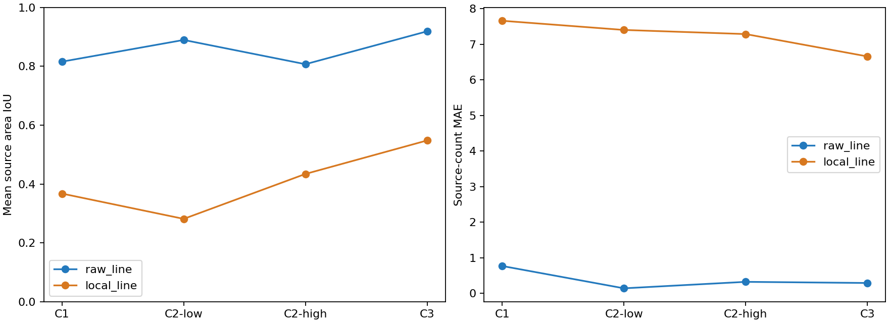
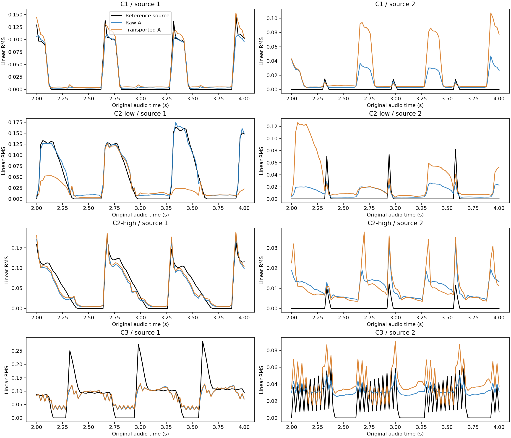

# #51 SSAST双来源课程：包络对照可拟合，局部关联尚未通过

2026-10-04，独立远程目录`/mnt/ssd/user/lgy/issue-51-ssast`，GPU0 RTX A6000。
冻结用户提供的SSAST Frame权重并保留混音RMS旁路后，直接包络监督对照在持续重叠C3
得到两源Test area IoU 0.937/0.900；有限局部关联线为0.649/0.447，并有严重的
余槽活动与复制包络。此次不能宣称正确匿名来源分离，也不满足推进三来源C4的条件。

此前[C0报告](issue-51-frame-c0.md)仍有效：原seed46 Val余槽误报4.87%，超过1%门槛。
用户明确允许继续双来源诊断；没有通过修改门限或删除失败seed来放行C0。

## 数据、预算与可复现证据

执行规则、损失及局部关联实现见[课程协议](../research/issue-51-courses.md)。每课程
train/val/test为4/2/2，固定pad/pluck两条分轨；同源重复音符仍是一条来源。
数据seed分别4640、51520、51540、51560，训练仅seed46。新旧样本各50% replay，
固定全部已见课程val选择checkpoint；test只做最终评分。没有未见音色泛化结论。

| 阶段 | 真实跨源重叠范围 | raw更新/总秒数 | 局部更新/总秒数 | 停止原因 |
|---|---:|---:|---:|---|
| C1：局部复现，无重叠 | 0% | 2000 / 11.8 | 39 / 129.7 | raw更新上限；局部时间预算 |
| C2-low：短尾部重叠 | 4.11–8.19% | 2000 / 10.7 | 36 / 132.5 | 同上 |
| C2-high：尾部延长 | 9.55–9.97% | 2000 / 11.8 | 35 / 139.5 | 同上 |
| C3：A衰减时B增强，A结束后B继续 | 33.73–35.13% | 2000 / 13.3 | 30 / 143.1 | 同上 |

重叠比例为评分区间1..11s内，双源RMS>0.001的中心数除以至少一源活动中心数；
范围覆盖全部8个样本。每中心真实2s输入，20ms评分网格，局部完整事件审计均通过。
局部训练循环预算120s，最后一次更新可越过预算，结束评估另耗时；表中总秒数包含评估。
局部只有30–39次更新，是短诊断，不能称收敛或SSAST能力上限。两线初始化/继承不同，
不能把差异单独归因于局部关联或骨干；也没有去除RMS旁路的对照。

C3初版仅延长pluck MIDI音长，实际仍迅速衰减，约8%重叠，未参与训练。
修订版用同一pluck样本在B分轨内每40ms重触发10次并提高力度，实现持续活动。
来源数保持2，不是增加10个来源。完整参数、事件、音频/标签hash及缓存digest见
`evidence/issue-51-course-{stage}-data.json`和`evidence/issue-51-course-{stage}-cache.json`。
首版非有限梯度及验证频率过稀的试跑记录见
[执行审计](../../evidence/issue-51-course-execution-audit.json)，均不混入正式课程结果。

## Test表现与失败项

以下是每阶段两个新课程test样本的等权平均，每对数字依次为来源1/2。
raw为独立的直接包络监督线，local为局部线经过同一C搬运A后的输出。
整段一次PIT；不做逐帧重分配。指标均为gate前，门限固定0.001。

| 阶段 | raw整段IoU | local整段IoU | raw重叠区IoU | local重叠区IoU | raw/local源数MAE |
|---|---|---|---|---|---|
| C1 | .911/.720 | .708/.026 | 无重叠 | 无重叠 | .771/7.660 |
| C2-low | .947/.832 | .524/.039 | .869/.929 | .433/.469 | .145/7.402 |
| C2-high | .948/.666 | .797/.071 | .843/.873 | .706/.543 | .326/7.286 |
| C3 | .937/.900 | .649/.447 | .945/.905 | .656/.616 | .294/6.659 |

C2-high来源2非重叠区raw IoU仅.0136，说明较好的整段/重叠区数值没有保证低能量尾部正确。
C3 raw两源full-scale MAE为.00420/.00216，local为.02685/.02194；其余分区幅值误差、
val/test、gate前后与每样本结果完整保存在[摘要JSON](../../evidence/issue-51-courses-summary.json)
和[完整JSON](../../evidence/issue-51-courses-full.json)。

局部线四阶段余槽误报比例均为100%，160ms活动块的复制候选比例均为100%，
每源静音误报比例也为100%。第二来源漏报为零是因为预测总有活动，不能作为成功证据。
raw余槽误报依次为11.16%、1.60%、0.0166%、0.2495%，所以raw C1也不满足集合门槛。
复制块指标：任意两个槽在160ms块内曲线cosine>.99，且各自面积超过该块真值总面积5%。
这是幅值复制诊断，不等于E方向全局塌缩；局部线原始活动E平均两两cosine约-.049到.183，
不足以支持“所有E相同”的归因。

局部线正确端点对应比例（两源）依次为0/.0667、.0938/.1333、.5625/0、.7333/.5313。
端点候选分配只在评估使用真值，不进入训练；.9s窗口几何共现不能替代正确身份。
C2-low两个test样本中一个整段PIT近似并列（gap<=1e-4），其余课程新test无并列；
完全同步不可区分形状没有加入本轮，不能据此宣称已解决歧义。
逐窗打乱候选的归一化MAE变化约0（最大绝对值7.45e-9），但复制活动也可打乱不变。
同一C搬运A的总量误差在float32数值范围内；这只验证计算守恒，不验证身份对应。

单槽混音RMS与8槽复制混音RMS均已评分。单槽在C1即使源数MAE为0，也无法保持两个
非重叠匿名来源身份；复制混音第二源漏报为0，却有大量额外候选。这两种反例与本轮局部
失败说明，集合数量、包络形状和正确局部对应必须同时评估。

## Replay、梯度与边界

最终C3 checkpoint在旧test上的两源IoU如下，未挑选对旧课程最好的一次checkpoint：

| 旧课程 | raw最终 | local最终 |
|---|---|---|
| C0（单源） | .880 | .678 |
| C1 | .924/.672 | .683/.060 |
| C2-low | .944/.795 | .703/.062 |
| C2-high | .936/.572 | .758/.038 |

raw旧C0由原seed46 .951降至.880，旧C2-high第二源也退化。50/50 replay没有消除遗忘。
逐阶段旧课程val/test完整矩阵位于摘要的`forgetting`字段。
课程1..11s评分不含padding；旧C0仍含边界padding，其历史99个边界窗审计继续保留，
没有把C0边界错误标成课程无padding结果。

shape损失经soft C到当前与被引用的真实过去E，训练日志记录了有限且非零的方向切向梯度。
首次有效帧直接锚定，零候选无E，超.9s断开为新fragment；fragment IDs与关系矩阵均保留。
下一次参考选择使用主匹配索引，是离散步骤，未声称整个参考选择可微。
首版递归混合描述子非有限梯度后改为最新真实候选，并增加有限梯度检查；数值修复没有
受控消融，不能证明失败原因只有递归混合。TimeCycle未实现，cycle=0。

16项frontend、C0及课程契约测试通过，包括真实零锚、长缺口新fragment、方向梯度、
同C搬运A、整段PIT、复制混音反例、6token感受野等价与长序列有限反传。
SSAST仍先计算全197个全局注意力token，缓存仅取时序头所需96..101六个token；
并非将输入截为六个token运行encoder。

下面展示局部线首个新课程test样本2..4s原时间轴。黑是真值，蓝是该局部checkpoint的
原始A，橙是同checkpoint的transported A；蓝线不是前表独立raw训练线。

本轮完成C1/C2/C3诊断，不开始C4，不合并PR。下一研究优先处理局部关联的活动分散与
候选集合误报，再以固定旧课程复验；当前结果不能支持增加来源数或加入更难音色轴。
