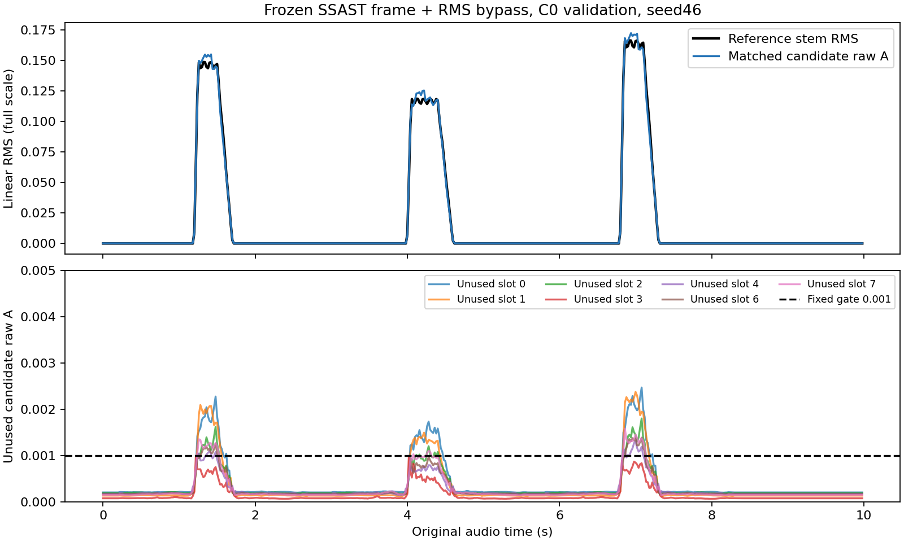

# #51 用户提供 frame 权重：P0 与 P1 C0 实测

2026-10-04，用户提供 `F:/LED/SSAST-Base-Frame-400.pth`，解除最初权重下载阻塞。
已完成frame P0、C0默认4/2/2数据重渲染、冻结时序特征缓存、1000步单样本诊断
及seed46/47/48的留出训练。**连续包络拟合通过，但整体P1门槛未通过：seed46验证集
未用候选误报4.87%，超过预设1%。因此P2没有启动。**

[研究#51](https://github.com/guajun/anonymous-audio-tracks/issues/51) /
[draft#52](https://github.com/guajun/anonymous-audio-tracks/pull/52)。
不是匿名分离结果，也不是SSAST相对Demucs或RMS旁路的优势证明。

## 1. 权重与frame P0

文件355117163字节；本地与远程SHA256均为
`b82b0714d92ddfd9de2c535b459ad900dea85a50c810dc43086fc6ac7047f689`。
按用户提供的来源记录使用，没有声称独立认证其原始下载出处。
官方固定源码`a1a3eecb94731e226308a6812f2fbf268d789caf`中全部166个预训练键严格加载，
无missing/unexpected；投影核128×2，预训练输入128×1024。
文件只读，远程副本位于独立`/mnt/ssd/user/lgy/issue-51-ssast/runs/p0/user-frame.pth`。

| 核查 | 实测 |
|---|---|
| 2秒log-fbank | 198×128，16kHz，25ms窗/10ms移位，固定官方统计 |
| stride128×1输出 | `[8,1,197,768]`，不含cls/dist，不取最终分类embedding |
| 局部时间中心 | 17.5ms..1977.5ms，10ms步长；投影支持35ms |
| 位置张量 | `[1,199,768]`，预训练时间位置裁剪起点158 |
| 同输入重复最大误差 | 0 |
| 坐标对离散卷积支持核验 | `2.22e-16`秒 |
| batch1 / batch4每窗encoder耗时 | 4.000ms / 2.807ms（后一次带来源字段的探针） |
| CUDA峰值allocated | 418280448字节，约399MiB |

计时仍只包含encoder，5次暖机后20次同步计时；frame初次测量为3.874/2.741ms，
不是成本改善实验。每个输出token可由self-attention看到完整2秒，35ms投影支持不是
整个模型感受野，10ms token步长不是已验证包络精度。
保留波形有效区间/投影支持掩码，补零不算真实证据。
机器证据：[frame P0](../../evidence/issue-51-p0-frame.json) 与
[来源核查记录](../../evidence/issue-51-p0-checkpoint-access.json)。

## 2. P1数据、头、损失与停止

调用main `prepare_c0`默认seed4600、4/2/2重新渲染；每首10秒、500个20ms预测中心，
共4000个2秒输入窗。每首99个边界窗有波形补零，边界单独记录。
缓存保留全部197×768时序token为float16，训练头计算float32；原尺度RMS旁路在原44.1kHz
多声道功率平均上测量20ms窗，未用单声道幅值平均代替标签。
所有素材摘要、缓存摘要及上下文比例保留；缓存约1.13GiB。
[缓存manifest](../../evidence/issue-51-p1-c0-cache.json)。

头：拼接RMS标量序列 → Linear hidden128 → 两层kernel3 temporal Conv1d+GELU →
1秒中心插值 → K8×128的V；A=||V||，骨干冻结eval/no_grad，没有Query、双头或分类embedding。
该head的中心仅依赖输入token96..101：优化时只计算这6个位置，全部197个已缓存token保留，
每个所选token仍看2秒输入。测试将优化结果与全序列计算直接比对，未改变感受野或输出定义。
中心1秒对应token索引98.25，按98/99以.75/.25插值；标签保持20ms原轴。

共同强度尺度`r=0.2591032087802887`，由train活跃RMS的P95计算。
目标在A/r上使用Huber(delta=.1)/.1 + .1×(1-areaIoU)；原单位delta=.0259103 full-scale RMS。
独立静音项为严格零参考处平均A/r，未用候选为整段未匹配7槽平均A/r，两项各权重.1。
整首一次PIT（C0从8槽选一个固定槽），评估匹配使用相同Huber+IoU shape组合。
训练不加硬gate；评估阈值固定1e-3 linear RMS，分别保留raw/门后结果。

AdamW lr1e-3、weight_decay1e-4、gradient clip1；batch为4首完整样本，逐首梯度累积以控内存。
先seed46单样本1000更新（约3.28秒）：归一化MAE .001539、areaIoU .969808，达到
小样本拟合门槛.05/.90。这一门槛只判断A可拟合，余槽误报仍为3.86%，不是集合验收。

正式每seed最多5000更新/3600秒；每100更新验证，至少1000更新，验证主shape相对改善
<1%连续10次则早停。最优checkpoint只按val主shape选择；未使用test选模型，
没有按事后余槽误报挑换checkpoint。实际提前停止不等于证明最优解或普遍收敛。

## 3. 留出结果与oracle

| seed | 更新数 / head训练秒数 | Val raw IoU | Test raw IoU | Val归一化MAE | Test归一化MAE | Val未用候选误报 | Test未用候选误报 |
|---|---|---|---|---|---|---|---|
| 46 | 2900 / 23.73 | .957750 | .950606 | .002504 | .003701 | **4.871%** | 6.329% |
| 47 | 4000 / 32.23 | .964302 | .954082 | .002071 | .003436 | .400% | 1.500% |
| 48 | 2200 / 18.96 | .958559 | .952728 | .002605 | .003746 | .629% | 1.086% |

误报比例是7个未用候选×全部中心的比例，不能把“4.87%”当成总活动幅值。
seed46 Val来源数MAE .341，其他两seed为.028/.044；Test分别.444/.106/.077。
匹配主候选的Val静音误报均0，Test均约.122%。onset/offset中位误差均0，
这是20ms标签网格与固定阈值下的统计，不能宣称亚20ms起止精度或没有任何边界错误。
每样本PIT次优差/并列、边界vs内部MAE、raw/gated误差/面积在完整seed证据中保留。

混音RMS oracle在C0与唯一分轨标签完全一致：train/val/test raw IoU=1、MAE=0。
全零基线IoU=0，Val/Test归一化MAE分别.058717/.073415。
故本次训练说明这条输入/头/损失链可以拟合单来源A，不证明分离，也不能确定
SSAST特征相对RMS旁路是否有额外贡献。三seed固定pad留出不是未见音色泛化。

## 4. 余槽泄漏与阈值诊断

seed46主候选拟合曲线良好，但余槽跟随主事件形成约.001..0024的小幅曲线，
部分跨过固定1e-3门限。Val两首的raw未用候选总面积分别为参考面积的11.76%/13.96%；
门后额外面积分别3.76%/2.30%。因此不能只用主轨IoU或门后图掩盖raw输出。

仅对已保存输出做阈值敏感性，不重训、不改变验收：seed46 Val平均余槽误报在
.5e-3/1e-3/2e-3下分别12.929%/4.871%/.500%；平均来源数MAE .905/.341/.035。
提高门限能减少计数误报，但没有修复raw泄漏，原1%门槛仍按1e-3判失败。
以cosine>.99且每候选面积>参考5%的整曲复制诊断没有命中这两首；
这只说明未达到该复制阈值，不否认图中相关的低幅泄漏，也不是局部对应验证。

## 5. 验证、证据与下一步

9个测试通过：P0四项，加P1裁剪补零、整首PIT不能抹掉换槽、V范数/参数梯度、
中心感受野优化对照、末帧边界与匹配代价五项。后续补充输入shape契约与非有限loss保护，
未为这两项防护重跑已完成训练。通用数据/标签/上下文模块和main依赖未改。
TimeCycle未实现/接入，无局部关联器、无长期原型、无回环；P2及shape→E关联梯度尚未验证。

正式head训练约74.92秒，加单样本约3.28秒；不包含渲染、缓存、hash、测试与P0。
缓存生成和运行日志/预测npz/checkpoint保留在独立远程runs目录，未把权重/大缓存提交到Git。
停止条件已触发，无后台训练继续运行。

证据：[summary](../../evidence/issue-51-p1-c0-summary.json)、
[baselines](../../evidence/issue-51-p1-c0-baselines.json)、
[seed46](../../evidence/issue-51-p1-c0-seed46.json)、
[seed47](../../evidence/issue-51-p1-c0-seed47.json)、
[seed48](../../evidence/issue-51-p1-c0-seed48.json)、
[单样本](../../evidence/issue-51-p1-c0-overfit.json)、
[阈值诊断](../../evidence/issue-51-p1-c0-sensitivity.json)。

下一项应单独验证余槽抑制与checkpoint选择：固定frame、数据、头和主shape，
只改变未用候选项的尺度/权重或val选择约束中的一个，先看train/val，
不凭test结果改门槛。RMS旁路消融作为后续独立问题；不把多变量变更归给backbone。
本轮保留失败证据并停在P1，不直接推进双来源或关联研究。
