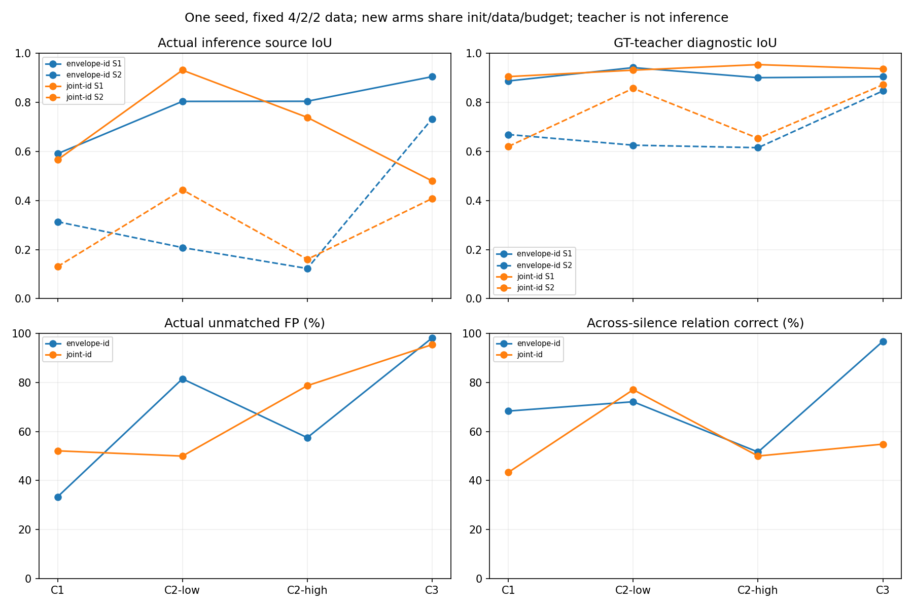
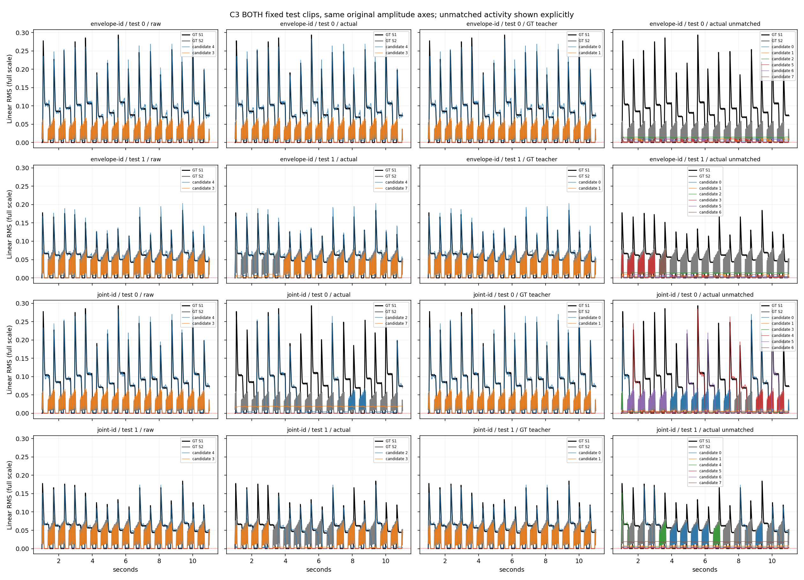
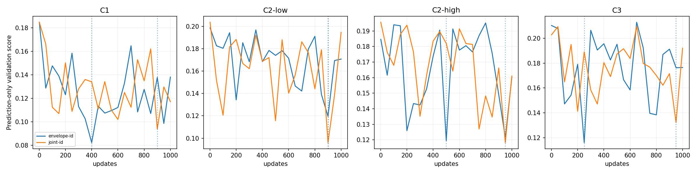

# #51 模长 + 预测身份联合教师：匹配课程重跑与失败审计

本轮教师求 P 确实读取预测 E，并直接评价完整训练片段的模长与双向异源 ID 损失。
主要推理仍只使用预测 V。完成真实 full197-token train-only pilot、可枚举验证、
两臂各四课程1000更新、selected checkpoint 重载和完整遗忘评估。
以下均为修正版 fit-v2；首版 fit-v1 的完整结果另存。验收失败，没有分离成功或收敛声明。

C3主要Actual：旧包络-ID.2为 .9053/.7333，联合-ID.2为 .4801/.4081；联合教师诊断
却为 .9373/.8723。C2-low有改善，C1/C3整体退步，不能用teacher高IoU替代实际来源保持。
联合C3跨静音同预测行34/62，旧包络60/62，余槽FP95.43%，最终C0 val余槽84.76%。
因此本轮新联合实现没有支持最终连接改善；这不是将旧包络实验冒充联合方案失败。

## 目标、可行域与控制变量

详见[执行协议](../research/issue-51-joint-teacher.md)。F(P)=L_amp(P)+.2 L_ID(P;c)。
L_amp 与训练完全相同：真实源 Huber/.1、全段 areaIoU、GT0点和余槽各 .1 平均模长；
ID 是原候选同源正对与两个真实异源竞争的 margin.2 排序 + .05 正拉近。
所有 GT 活动/置信权重与训练一致，分母仅 GT 活动，不允许对应自己降低置信。
c 在求 P 前冻结，为 GT 全段包络可辨度乘候选方向 spread。两臂共享此规则。
它不是正确身份后验：小幅空轨随机方向也可能扩大 spread，复制/相同 GT 的完整歧义
有降权，但部分复制与包络近似仍需审计，不能将高可靠度当正确标签。

身份方向早期可能错误。教师限制全段模长损失最多比无索引先验的包络初始化增加 .02，
并保护每个 GT 非零节点：其包络绝对误差最多比初始化增加 .02（固定 r 尺度）。
首版只有全段限制，穷举小例仍会牺牲真实节点选近零候选，因此被否决为最终方案；
修正版加入逐节点保护，且完整重跑。界限是启发式，弱 GT 仍可能在容差内被低估，
错误包络初始化也不会自动成为正确真值，不能宣称无错误标签。

训练每16帧共享对应，逐块全部8P1/8P2状态做一次坐标搜索。每次评价精确完整 F，
包括所有跨块 ID 对与完整 IoU；不存在候选索引连续性先验。求解不是全局最优。
P/G 都是硬一对一，GT0 身份未定义，零轨继续接受原模长监督。没有向量平均抵消，
没有 .001 预测训练 gate；.001 只作固定评估。主要推理仍为原相邻预测 cosine
连续可靠度 + Hungarian，未修推理/轴/活动判据，teacher 指标不选 checkpoint。

envelope-id 是旧包络 teacher(block16,switch.01) + ID.2；joint-id 更换对应求解。
两臂相同初始化、完整输入、head、RMS旁路、数据、抽样seed4650..4653、50/50 replay、
AdamW/clip、预算和预测-only选权重。共同置信变化与上一轮历史 ID.2 区分；
历史 ID0/.2 对照和旧 raw/local 都保留，不能混作本轮匹配因果对照。

## 可枚举验证与近似误差

36 tests passed。24个四帧3P2随机小例的穷举范围为6^4，单遍坐标有 3 个非最优，最大差 0.00779711。
首版相同随机范围有 11 个非最优，最大差 0.07745506；两版可行集合不同，不能把差的下降当更强全局优化证明。

| 小例 | 初始完整 F | 坐标后 F | 穷举 F | 教师/torch成本绝对误差 |
|---|---:|---:|---:|---:|
| identity_swap | 0.10495748 | 0.07013456 | 0.07013456 | 5.70e-09 |
| stable_identity | 0.00000142 | 0.00000142 | 0.00000142 | 1.40e-09 |
| strong_conflict | 0.13893013 | 0.09302986 | 0.09302986 | 6.45e-09 |
| all_zero_gt | 0.06102571 | 0.06102571 | 0.06102571 | 0.00e+00 |
| near_zero_gt | 0.00000000 | 0.00000000 | 0.00000000 | 5.11e-16 |
| copied_outputs | 0.04203491 | 0.04203491 | 0.04203491 | 2.63e-09 |

保持模长不变、只改变 E，教师对应会改变；复制输出/相同 GT 降权，GT0无ID，
近零方向梯度有限且非零、跨静音有声端点与真实双向竞争、一对一及禁止抵消都验证。
block1穷举在逐帧候选打乱下最优目标/解集合等变；对称并列最优可选不同标签。
训练block16对块内逐帧随机打乱不等变，这是限制，不能用推理打乱测试掩盖。

| C3 train-only求解敏感性 | 完整 F | 模长项 | ID项 | 秒 |
|---|---:|---:|---:|---:|
| block16, sweeps1 | 0.00885289 | 0.00884084 | 0.00006025 | 0.070 |
| block16, sweeps3 | 0.00885289 | 0.00884084 | 0.00006025 | 0.104 |
| block1, sweeps1 | 0.00869630 | 0.00855139 | 0.00072454 | 1.758 |

改变block也改变初始化和可行域，因此这些差不是完整自由排列目标的全局误差界。
同block的额外遍数才是在同一可行域内测试剩余局部改进；低成本不等于正确来源。
真实C3 train `no_identity_objective` 相对最终教师的 GT非零节点对应变化 0.00%。
真实C3 train `same_norm_same_reliability_time_direction_flip` 相对最终教师的 GT非零节点对应变化 0.00%。
这两个真实样本干预都未改对应，尽管翻转 E 显著改变 ID 成本；当前约束与包络拟合
主导了最终可行标签。不能由合成例中 E 改标签就声称真实缓存中有足够身份选择空间。
训练记录步（非C0）共126个样本：有接受坐标更换6个，有ID项下降>1e-7共4个。
记录步不是所有更新的普查；更换也可能由完整模长目标驱动，不能单独证明ID造成更换。

## 固定当前课程 test：主要推理/raw/教师分别报告

| Arm | Course | Actual IoU A/B | Raw IoU A/B | Teacher IoU A/B | Actual MAE/r | 原轴源MAE A/B |
|---|---|---|---|---|---:|---|
| envelope-id | C1 | 0.5911/0.3135 | 0.8742/0.5642 | 0.8877/0.6693 | 0.030790 | 0.0147/0.0013 |
| envelope-id | C2-low | 0.8045/0.2082 | 0.9423/0.6259 | 0.9423/0.6259 | 0.038959 | 0.0161/0.0041 |
| envelope-id | C2-high | 0.8050/0.1228 | 0.9012/0.6156 | 0.9012/0.6156 | 0.029615 | 0.0129/0.0024 |
| envelope-id | C3 | 0.9053/0.7333 | 0.9053/0.8471 | 0.9053/0.8471 | 0.023924 | 0.0061/0.0063 |
| joint-id | C1 | 0.5665/0.1305 | 0.8798/0.4855 | 0.9056/0.6206 | 0.029274 | 0.0124/0.0027 |
| joint-id | C2-low | 0.9319/0.4438 | 0.9319/0.8576 | 0.9319/0.8576 | 0.012321 | 0.0045/0.0018 |
| joint-id | C2-high | 0.7392/0.1602 | 0.9545/0.6538 | 0.9545/0.6538 | 0.031034 | 0.0142/0.0019 |
| joint-id | C3 | 0.4801/0.4081 | 0.9373/0.8723 | 0.9373/0.8723 | 0.096449 | 0.0343/0.0157 |

所有 IoU 和 MAE 来自原线性 RMS，不是log轴或teacher推理结果。Teacher强制真实行0:S，
不再次PIT。主要Actual用整段PIT评估预测推理。固定gate前后和输出缩放.5/1/2在JSON
分别保存；输出缩放不是音频输入增益泛化。

| Arm | Course | 空轨FP | 静音FP A/B | 额外面积 | 数量MAE | 复制窗口率 | 全8 MAE/r |
|---|---|---:|---|---:|---:|---:|---:|
| envelope-id | C1 | 33.35% | 31.16%/32.94% | 0.5885 | 2.4431 | 55.76% | 0.017545 |
| envelope-id | C2-low | 81.49% | 93.16%/55.33% | 0.8401 | 5.8333 | 55.81% | 0.038626 |
| envelope-id | C2-high | 57.49% | 85.03%/58.42% | 0.2658 | 4.2455 | 4.26% | 0.015507 |
| envelope-id | C3 | 98.15% | 100.00%/85.08% | 0.4375 | 6.4900 | 65.08% | 0.022920 |
| joint-id | C1 | 52.11% | 66.39%/26.97% | 1.1182 | 3.7655 | 90.62% | 0.023959 |
| joint-id | C2-low | 49.97% | 99.79%/19.08% | 0.3893 | 3.6377 | 42.15% | 0.015543 |
| joint-id | C2-high | 78.68% | 57.05%/33.48% | 0.5478 | 5.1218 | 75.53% | 0.024381 |
| joint-id | C3 | 95.43% | 98.18%/73.56% | 0.8895 | 6.2405 | 76.19% | 0.059286 |

硬连接保留逐帧活动槽数量与全部模长，数量超标源自head原候选；排列不能新增槽。
空轨已有.1线性监督，近零梯度不自动消失。复制窗口率结合面积解释，FP本身不证明复制。

## 教师标签、身份关系和梯度审计

| Joint current test | 旧包络对应变化(有声) | F前/后 | Amp前/后 | ID前/后 | 教师/训练成本max误差 |
|---|---:|---|---|---|---:|
| C1 | 0.00% | 0.02760/0.02760 | 0.02755/0.02755 | 0.00024/0.00024 | 5.04e-09 |
| C2-low | 0.00% | 0.01385/0.01385 | 0.01384/0.01384 | 0.00004/0.00004 | 4.33e-09 |
| C2-high | 0.00% | 0.02272/0.02272 | 0.02249/0.02249 | 0.00113/0.00113 | 7.29e-09 |
| C3 | 0.00% | 0.01399/0.01399 | 0.01397/0.01397 | 0.00009/0.00009 | 3.08e-09 |

完整 before/after、每次接受下降、可行状态数、条件状态gap、GT有声拟合残差及超过最佳
单候选包络的误差都保存。条件gap不是全局posterior；teacher最低F不自动证明真实身份。

| Arm | Course | 正cos | 负cos | margin违反 | 跨静音同预测行 | 跨静音都在GT对齐源行 | 可靠度均值 |
|---|---|---:|---:|---:|---:|---:|---:|
| envelope-id | C1 | 0.9867 | -0.1019 | 0.00% | 68.33% (60) | 53.33% (32/60) | 0.9237 |
| envelope-id | C2-low | 0.9932 | -0.1917 | 0.26% | 72.13% (61) | 55.74% (34/61) | 0.9613 |
| envelope-id | C2-high | 0.9965 | -0.2685 | 0.07% | 51.61% (62) | 43.55% (27/62) | 0.9616 |
| envelope-id | C3 | 0.9969 | -0.3422 | 0.00% | 96.77% (62) | 91.94% (57/62) | 0.9578 |
| joint-id | C1 | 0.9941 | -0.1667 | 0.00% | 43.33% (60) | 33.33% (20/60) | 0.9237 |
| joint-id | C2-low | 0.9991 | -0.2552 | 0.00% | 77.05% (61) | 70.49% (43/61) | 0.9613 |
| joint-id | C2-high | 0.9942 | -0.2863 | 0.21% | 50.00% (62) | 37.10% (23/62) | 0.9616 |
| joint-id | C3 | 0.9982 | -0.2921 | 0.00% | 54.84% (62) | 25.81% (16/62) | 0.9578 |

同预测行率比GT源行率弱；静音节点没有被强迫拥有身份，检查的是前后真实有声端点。
具体错误端点与期望行保存在selected验证JSON。标签仍只能以GT RMS审计，不能认证
包络完全相同的真实物理源身份。正负cos和相邻准确率均不能替代整段IoU。

| Arm | Course | Amp径向 | ID切向 | ID径向 | 共享投影梯度cos |
|---|---|---:|---:|---:|---:|
| envelope-id | C1 | 0.253948 | 0.284095 | 9.75e-09 | -0.0473 |
| envelope-id | C2-low | 0.220936 | 0.244541 | 9.52e-09 | 0.0898 |
| envelope-id | C2-high | 0.191143 | 0.220485 | 6.62e-09 | -0.0298 |
| envelope-id | C3 | 0.085937 | 0.352591 | 1.75e-08 | 0.0477 |
| joint-id | C1 | 0.256250 | 0.559386 | 1.42e-08 | -0.0114 |
| joint-id | C2-low | 0.244376 | 0.403265 | 1.49e-08 | -0.0202 |
| joint-id | C2-high | 0.196747 | 0.304062 | 6.81e-09 | 0.0273 |
| joint-id | C3 | 0.082800 | 0.209823 | 1.29e-08 | -0.0491 |

联合C3跨静音28次同预测行失败：源0 17次，源1 11次；全部两端teacher选择同一原候选。
在这些候选的间隙共定位38次行变化，32次左节点GT0，9次两端GT0，35次相邻方向cos为负。
这是后验错误定位，未用test调阈值或选权重。GT0方向未监督，而相邻预测推理仍通过这些
节点连接，给出明确训练/推理差距；不据此强迫真实静音节点有稳定身份。
联合C3 raw/teacher IoU相同而实际大幅退步，原候选未匹配面积约.4603，实际约.8895：
真源活动流入整段PIT未选的轨迹，并不是硬关联创建新的幅度；逐帧数量保持不变。
[逐事件诊断](../../evidence/issue-51-joint-gap-failures.json)保存时间、GT/预测幅度、cos及换行。

这是记录步的等样本均值，不是完整优化轨迹；共享梯度冲突和teacher低成本不能证明易学。

## 最终 selected C3：完整已见遗忘

| Arm | Split | Old course | Actual IoU | Actual空轨FP | 数量MAE |
|---|---|---|---|---:|---:|
| envelope-id | validation | C0 | 0.7854 | 86.66% | 6.9000 |
| envelope-id | validation | C1 | 0.8614/0.4958 | 97.21% | 6.7285 |
| envelope-id | validation | C2-low | 0.8308/0.1994 | 94.59% | 6.5948 |
| envelope-id | validation | C2-high | 0.9108/0.3253 | 96.22% | 6.3802 |
| envelope-id | validation | C3 | 0.9145/0.8312 | 98.39% | 6.5459 |
| envelope-id | test | C0 | 0.8341 | 86.70% | 6.8960 |
| envelope-id | test | C1 | 0.8541/0.3203 | 97.17% | 6.7495 |
| envelope-id | test | C2-low | 0.8951/0.1883 | 91.50% | 6.5679 |
| envelope-id | test | C2-high | 0.9438/0.1621 | 93.90% | 6.4032 |
| envelope-id | test | C3 | 0.9053/0.7333 | 98.15% | 6.4900 |
| joint-id | validation | C0 | 0.7321 | 84.76% | 6.7670 |
| joint-id | validation | C1 | 0.8576/0.3439 | 92.17% | 6.7116 |
| joint-id | validation | C2-low | 0.9234/0.2522 | 90.90% | 6.4112 |
| joint-id | validation | C2-high | 0.8800/0.5051 | 92.27% | 5.9072 |
| joint-id | validation | C3 | 0.4501/0.7549 | 97.94% | 6.1816 |
| joint-id | test | C0 | 0.7714 | 84.90% | 6.7690 |
| joint-id | test | C1 | 0.8648/0.3179 | 93.90% | 6.6926 |
| joint-id | test | C2-low | 0.9223/0.3153 | 92.38% | 6.4052 |
| joint-id | test | C2-high | 0.9332/0.3156 | 94.05% | 6.2535 |
| joint-id | test | C3 | 0.4801/0.4081 | 95.43% | 6.2405 |

原C0 seed46 val余槽4.87%>1%和历史三seed test约.951-.954保持原失败解释。
本轮也没有通过空轨/数量与全部已见课程验收。旧raw C3 .9252/.8807、余槽1.80%保留，
但其训练、选择和推理不同，不能直接作本轮教师单独因果比较。

## 预算、验证与证据

| Arm | Stage | Updates | Selected update | Stop | Head阶段秒 |
|---|---|---:|---:|---|---:|
| envelope-id | C1 | 1000 | 400 | max_updates | 60.25 |
| envelope-id | C2-low | 1000 | 900 | max_updates | 61.45 |
| envelope-id | C2-high | 1000 | 500 | max_updates | 63.34 |
| envelope-id | C3 | 1000 | 250 | max_updates | 64.11 |
| joint-id | C1 | 1000 | 900 | max_updates | 97.72 |
| joint-id | C2-low | 1000 | 900 | max_updates | 117.16 |
| joint-id | C2-high | 1000 | 950 | max_updates | 125.12 |
| joint-id | C3 | 1000 | 950 | max_updates | 146.07 |

修正版两臂8000总更新，runner wall 520.04s。首版另有8000更新和510.03s，均保留；两个pilot各20更新。
以上仅缓存后head阶段，不冒充完整SSAST特征提取成本。只用GPU0；GPU1和外部进程未管理。
没有实际云账单，未虚构金额；原输入特征成本见历史报告。全部达到更新上限，不称收敛。
selected重载复查 56 个NPZ，V最大误差 0.00e+00，活动数量守恒max差 0。
归档 56 个有限NPZ，最大总模长误差 5.96e-08；初始权重SHA一致=True。

证据：[汇总](../../evidence/issue-51-joint-id-summary.json)、
[旧包络臂原始](../../evidence/issue-51-envelope-id-full.json.gz)、
[联合臂原始](../../evidence/issue-51-joint-id-full.json.gz)、
[穷举](../../evidence/issue-51-joint-small.json)、
[首版完整负面结果](../../evidence/issue-51-joint-v1-preserved-full.json.gz)、
[selected验证](../../evidence/issue-51-joint-selected-verification.json)、
[SHA执行审计](../../evidence/issue-51-joint-execution-audit.json)。

服务器独立clone保存 runs/joint-teacher/fit-v2 下每阶段 selected/last、日志、NPZ；
runs/joint-teacher/fit-v1 原始首版和 source 快照不覆盖。预测ZIP独立保存并核对SHA。
固定4/2/2、小样本单seed、固定pad/pluck音色，仅研究当前任务。不声称统计显著性、
未见音色/输入增益泛化、SSAST相对RMS收益；没有C4。Issue保持开放，PR保持draft，不merge。
