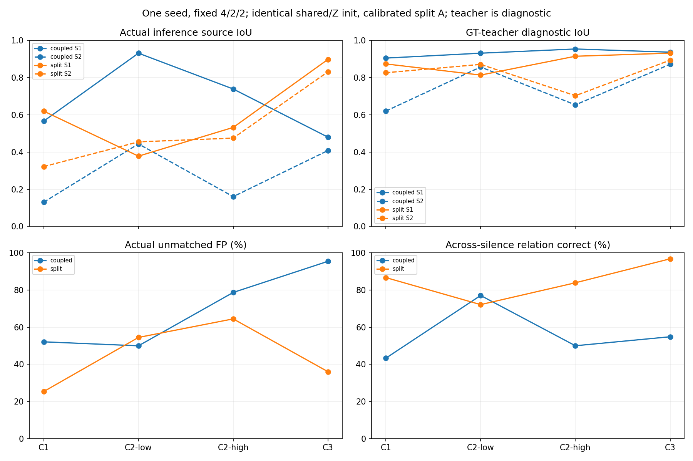
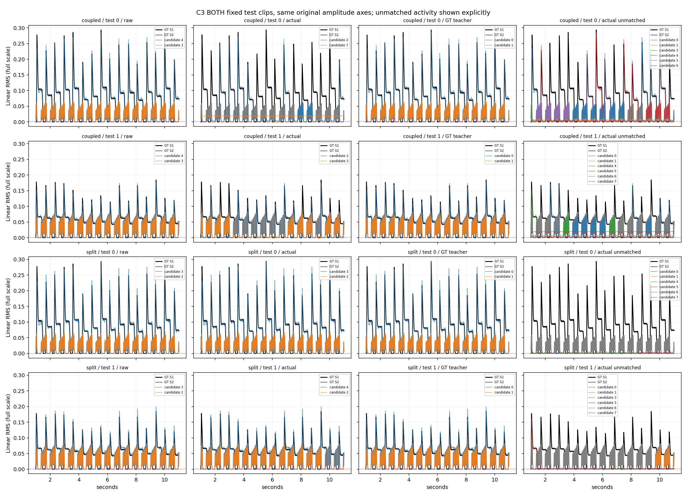
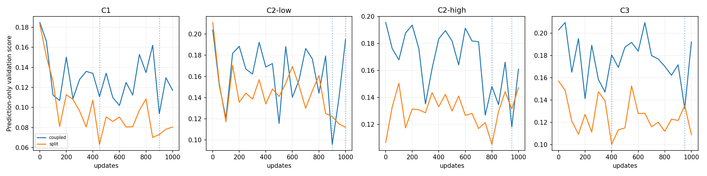

# #51 响度/身份拆头：匹配课程与初始化限制

本轮完成耦合结构 vs 标量响度拆头的匹配联合教师+ID.2对照。旧纯包络教师、联合教师fit-v1/fit-v2与原C0失败均完整保留。以下主结果都是预测-only相邻Hungarian推理，teacher仅为诊断，不用于checkpoint选择。

新匹配两臂C3 test：耦合Actual 0.4801/0.4081，拆头Actual 0.8985/0.8317；拆头Raw 0.9321/0.8943、Teacher 0.9321/0.8943。拆头空轨FP 36.04%，数量MAE 2.3383。

C3连接改善，但整体验收仍失败：拆头最终C0 val空轨57.03%远超1%，C0 test IoU从耦合.7714退到.5370；C2-low主源IoU从.9319退到.3780。单seed、固定小样本及非零初始化残差不允许普遍改善或统计显著性结论。

## 输出参数化与固定变量

共享769→128投影、4Conv3/GELU及center98.25+full197 mean/std不变。耦合为A=norm(V)、E=normalize(V)，689,920参数；拆头为A=abs(Linear384→8)、Z=原Linear384→8×128、E=normalize(Z)，693,000参数，增加3,080（0.4464%）。所有身份仍128维。独立A直接进入幅度损失、联合教师、推理连续可靠度与硬排列；Z的norm只用于方向归一化，从未重新充当响度。

两臂均修正版joint-teacher fit-v2：F=L_amp+.2L_ID，完整片段目标、block16单遍坐标、全段amp上界+.02和逐GT非零节点误差保护+.02。冻结GT包络可辨度×direction spread可靠度不变；可靠度不是正确标签posterior。GT0身份未定义、余轨/GT0独立A线性监督、双向异源margin.2+.05正拉近、offset1/2/5/15/30/45、radius45均不变。无.001训练硬gate，无向量抵消。单遍坐标并非全局最优，原穷举3/24非最优、maxgap .007797证据仍保留。

完整197×768冻结缓存、固定线性r=.2591032087802887、4train/2val/2test、pad/pluck、C3重触发不变。seed4650..4653、50/50 replay、AdamW lr.001 decay.0001 clip1、每课1000更新、每50步val及7200秒安全budget不变。所有已见val等样本评分：MAE/r+.1(1-meanIoU)+.1unusedmeanA/r+.01countMAE；test和teacher均不选checkpoint。推理保持原相邻cosine/连续可靠度/Hungarian，A守恒。

## 公平初始化：已复制的部分与无法精确匹配的部分

共享层和128维Z输出层逐tensor完整复制历史C1-raw初始化，train上的Z最大差为0。新响度层只用C0/C1共8个训练缓存、以旧head A为目标，直接旧A ridge1e-6后1000次cached-feature Adam MSE；不读取val/test，不拟合GT，不更新共享/Z。耦合臂做同训练特征1000次readout零残差控制，保持已有参数。这是相同pass预算，优化工作与墙钟成本不同；不能把校准额外成本隐藏进正式课程。

初始化耗时拆头1.603s、耦合控制0.151s。标量abs affine无法精确表示128维affine向量norm：平均幅度差、峰值差和活动数量差见下表。这些起点差异是实际混杂，不能将观察差异全部归因于梯度解耦。这里记录参数化而不是宣称精确同初始预测。

| Train clip | A/r MAE | A/r max差 | 相对mean A | 活动数量MAE |
|---|---:|---:|---:|---:|
| c0-train-00 | 0.000092 | 0.003787 | 1.28% | 0.0040 |
| c0-train-01 | 0.000095 | 0.004075 | 2.68% | 0.0080 |
| c0-train-02 | 0.000118 | 0.006909 | 1.13% | 0.0380 |
| c0-train-03 | 0.000176 | 0.008881 | 0.97% | 0.0920 |
| c1-local-train-00 | 0.000222 | 0.006000 | 1.72% | 0.1497 |
| c1-local-train-01 | 0.000178 | 0.006631 | 1.51% | 0.0619 |
| c1-local-train-02 | 0.000202 | 0.008285 | 1.44% | 0.1277 |
| c1-local-train-03 | 0.000252 | 0.007962 | 1.49% | 0.1996 |

原初始化SHA256 `83ff4753abc0c79f006e4d6b6b104f30a80cd907ffb05a9ed05c3cabe81b33c3`；耦合归档 `8cfec2f5aa52658d86f567e537f164814a76ccb9de689431ef864858a3fa34ee`；拆头 `1ef2b4ba6d35307ec2b95af2b90cfe898a13fb1349793c3d3909006a249c8485`。归档序列化SHA不同，不代表复制tensor不同；独立执行审计逐tensor验证共同部分与原权重相等。用户SSAST权重SHA保持 `b82b0714d92ddfd9de2c535b459ad900dea85a50c810dc43086fc6ac7047f689`，原来源未认证。

初始train-only完整actual/raw/teacher诊断也归档。正式训练不是从pilot末权重继续，pilot每臂20更新后丢弃，分别重新加载已校准初始化。

## 每课程当前test：原线性轴

| Arm | Course | Actual IoU A/B | Raw IoU A/B | Teacher IoU A/B | Actual MAE/r | Actual原轴MAE A/B |
|---|---|---|---|---|---:|---|
| coupled | C1 | 0.5665/0.1305 | 0.8798/0.4855 | 0.9056/0.6206 | 0.029274 | 0.0124/0.0027 |
| coupled | C2-low | 0.9319/0.4438 | 0.9319/0.8576 | 0.9319/0.8576 | 0.012321 | 0.0045/0.0018 |
| coupled | C2-high | 0.7392/0.1602 | 0.9545/0.6538 | 0.9545/0.6538 | 0.031034 | 0.0142/0.0019 |
| coupled | C3 | 0.4801/0.4081 | 0.9373/0.8723 | 0.9373/0.8723 | 0.096449 | 0.0343/0.0157 |
| split | C1 | 0.6201/0.3219 | 0.8203/0.3781 | 0.8741/0.8269 | 0.029745 | 0.0137/0.0017 |
| split | C2-low | 0.3780/0.4548 | 0.8142/0.7693 | 0.8142/0.8715 | 0.094665 | 0.0472/0.0018 |
| split | C2-high | 0.5325/0.4751 | 0.9154/0.7032 | 0.9154/0.7032 | 0.067512 | 0.0341/0.0009 |
| split | C3 | 0.8985/0.8317 | 0.9321/0.8943 | 0.9321/0.8943 | 0.018886 | 0.0060/0.0038 |

Teacher固定GT源行，不再PIT掩盖对应错误；Actual/Raw使用原整段PIT评价。完整val/test、gate前后与输出gain诊断见JSON，输出缩放不代表输入增益泛化。

| Arm | Course | 空轨FP | 静音FP A/B | 额外面积 | Count MAE | 复制窗口率 | 全8 MAE/r |
|---|---|---:|---|---:|---:|---:|---:|
| coupled | C1 | 52.11% | 66.39%/26.97% | 1.1182 | 3.7655 | 90.62% | 0.023959 |
| coupled | C2-low | 49.97% | 99.79%/19.08% | 0.3893 | 3.6377 | 42.15% | 0.015543 |
| coupled | C2-high | 78.68% | 57.05%/33.48% | 0.5478 | 5.1218 | 75.53% | 0.024381 |
| coupled | C3 | 95.43% | 98.18%/73.56% | 0.8895 | 6.2405 | 76.19% | 0.059286 |
| split | C1 | 25.37% | 46.46%/22.17% | 0.5710 | 2.0389 | 43.42% | 0.016874 |
| split | C2-low | 54.47% | 65.26%/30.17% | 0.7927 | 3.7325 | 0.00% | 0.051247 |
| split | C2-high | 64.45% | 86.21%/13.11% | 0.5816 | 4.2695 | 0.00% | 0.036677 |
| split | C3 | 36.04% | 81.75%/1.80% | 0.1212 | 2.3383 | 1.59% | 0.009144 |

## 跨静音与cos：两种端点标准

| Arm | Course | 同任意预测行 | 两端都在整段GT对齐源行 | 正cos | 负cos | margin违反 | 可靠度 |
|---|---|---|---|---:|---:|---:|---:|
| coupled | C1 | 26/60 (43.33%) | 20/60 (33.33%) | 0.9941 | -0.1667 | 0.00% | 0.9237 |
| coupled | C2-low | 47/61 (77.05%) | 43/61 (70.49%) | 0.9991 | -0.2552 | 0.00% | 0.9613 |
| coupled | C2-high | 31/62 (50.00%) | 23/62 (37.10%) | 0.9942 | -0.2863 | 0.21% | 0.9616 |
| coupled | C3 | 34/62 (54.84%) | 16/62 (25.81%) | 0.9982 | -0.2921 | 0.00% | 0.9578 |
| split | C1 | 52/60 (86.67%) | 44/60 (73.33%) | 0.9998 | 0.1882 | 0.00% | 0.9237 |
| split | C2-low | 44/61 (72.13%) | 25/61 (40.98%) | 1.0000 | -0.6038 | 0.00% | 0.9613 |
| split | C2-high | 52/62 (83.87%) | 38/62 (61.29%) | 1.0000 | -0.3448 | 0.00% | 0.9616 |
| split | C3 | 60/62 (96.77%) | 57/62 (91.94%) | 1.0000 | -0.2670 | 0.00% | 0.9578 |

同预测行比严格GT源行标准弱。GT0未要求稳定身份；检查的是间隙前后真实有声端点。即使正cos高、负cos低，也不能替代整段来源保持。标签来自GT RMS拟合，包络相同的真实物理源仍不能认证。

## 梯度与教师目标审计

| Arm | Course | Amp对Z径向norm | ID切向norm | ID径向norm | 共享投影梯度cos |
|---|---|---:|---:|---:|---:|
| coupled | C1 | 0.256250 | 0.559386 | 1.42e-08 | -0.0114 |
| coupled | C2-low | 0.244376 | 0.403265 | 1.49e-08 | -0.0202 |
| coupled | C2-high | 0.196747 | 0.304062 | 6.81e-09 | 0.0273 |
| coupled | C3 | 0.082800 | 0.209823 | 1.29e-08 | -0.0491 |
| split | C1 | 0.000000 | 0.179220 | 5.05e-09 | 0.1767 |
| split | C2-low | 0.000000 | 0.000136 | 1.51e-09 | 0.1357 |
| split | C2-high | 0.000000 | 0.000037 | 6.96e-10 | -0.0976 |
| split | C3 | 0.000000 | 0.000294 | 3.85e-10 | 0.0528 |

拆头Amp对Z梯度为0说明输出路径独立，不说明A/共享幅度梯度为0。ID不更新独立A输出层，但两项仍通过共享特征冲突；共享梯度cos为记录步等样本均值，不是完整轨迹，也不能证明易学。

| Arm | Course | 对旧包络有声对应变化 | F before/after | Amp before/after | ID before/after | 教师/torch最大误差 |
|---|---|---:|---|---|---|---:|
| coupled | C1 | 0.00% | 0.027599/0.027599 | 0.027550/0.027550 | 0.000243/0.000243 | 5.21e-09 |
| coupled | C2-low | 0.00% | 0.013845/0.013845 | 0.013837/0.013837 | 0.000040/0.000040 | 4.29e-09 |
| coupled | C2-high | 0.00% | 0.022721/0.022721 | 0.022494/0.022494 | 0.001135/0.001135 | 7.10e-09 |
| coupled | C3 | 0.00% | 0.013990/0.013990 | 0.013973/0.013973 | 0.000086/0.000086 | 3.55e-09 |
| split | C1 | 0.00% | 0.021382/0.021382 | 0.021381/0.021381 | 0.000007/0.000007 | 4.53e-09 |
| split | C2-low | 0.00% | 0.031333/0.031333 | 0.031333/0.031333 | 0.000000/0.000000 | 5.18e-09 |
| split | C2-high | 0.00% | 0.022903/0.022903 | 0.022903/0.022903 | 0.000000/0.000000 | 9.68e-10 |
| split | C3 | 0.00% | 0.011687/0.011687 | 0.011686/0.011686 | 0.000001/0.000001 | 7.49e-09 |

真实C3 train-only额外搜索与方向干预（不用test改规则）：

| Arm | Block | Sweeps | F | Amp | ID | 秒 |
|---|---:|---:|---:|---:|---:|---:|
| coupled | 16 | 1 | 0.00885289 | 0.00884084 | 0.00006025 | 0.065 |
| coupled | 16 | 3 | 0.00885289 | 0.00884084 | 0.00006025 | 0.102 |
| coupled | 1 | 1 | 0.00869630 | 0.00855139 | 0.00072454 | 1.783 |
| split | 16 | 1 | 0.00709188 | 0.00709173 | 0.00000077 | 0.068 |
| split | 16 | 3 | 0.00709188 | 0.00709173 | 0.00000077 | 0.109 |
| split | 1 | 1 | 0.00508107 | 0.00506248 | 0.00009292 | 1.793 |

coupled `no_identity_objective` 有声对应变化 0.00%。

coupled `same_A_same_reliability_time_direction_flip` 有声对应变化 0.00%。

split `no_identity_objective` 有声对应变化 0.00%。

split `same_A_same_reliability_time_direction_flip` 有声对应变化 0.00%。

独立A额外24个四帧3P2穷举：0个坐标非最优，maxgap 0.00000000。此有限样本零差不提供全局最优保证；原耦合随机例3/24非最优仍保留。

block变化也改变初始化/可行集合，因此跨block成本差不是自由排列全局误差界。同block额外sweep才在相同可行集合审计剩余局部改善。不得用合成身份交换例夸大真实缓存的ID选择空间。

## 最终C3 selected：所有已见课程遗忘

| Arm | Split | Course | Actual IoU | 空轨FP | Count MAE |
|---|---|---|---|---:|---:|
| coupled | validation | C0 | 0.7321 | 84.76% | 6.7670 |
| coupled | validation | C1 | 0.8576/0.3439 | 92.17% | 6.7116 |
| coupled | validation | C2-low | 0.9234/0.2522 | 90.90% | 6.4112 |
| coupled | validation | C2-high | 0.8800/0.5051 | 92.27% | 5.9072 |
| coupled | validation | C3 | 0.4501/0.7549 | 97.94% | 6.1816 |
| coupled | test | C0 | 0.7714 | 84.90% | 6.7690 |
| coupled | test | C1 | 0.8648/0.3179 | 93.90% | 6.6926 |
| coupled | test | C2-low | 0.9223/0.3153 | 92.38% | 6.4052 |
| coupled | test | C2-high | 0.9332/0.3156 | 94.05% | 6.2535 |
| coupled | test | C3 | 0.4801/0.4081 | 95.43% | 6.2405 |
| split | validation | C0 | 0.7087 | 57.03% | 4.6250 |
| split | validation | C1 | 0.3108/0.6620 | 70.21% | 4.4012 |
| split | validation | C2-low | 0.7192/0.7381 | 66.38% | 4.4421 |
| split | validation | C2-high | 0.6477/0.6745 | 58.70% | 3.6248 |
| split | validation | C3 | 0.9266/0.8691 | 26.16% | 1.8613 |
| split | test | C0 | 0.5370 | 64.29% | 4.7060 |
| split | test | C1 | 0.4559/0.6523 | 71.47% | 4.8303 |
| split | test | C2-low | 0.3541/0.7929 | 64.37% | 3.9810 |
| split | test | C2-high | 0.4934/0.6435 | 65.95% | 4.2086 |
| split | test | C3 | 0.8985/0.8317 | 36.04% | 2.3383 |

## 执行预算与可复查证据

| Arm | Course | Updates | Selected update | Stop | 秒 |
|---|---|---:|---:|---|---:|
| coupled | C1 | 1000 | 900 | max_updates | 93.93 |
| coupled | C2-low | 1000 | 900 | max_updates | 114.71 |
| coupled | C2-high | 1000 | 950 | max_updates | 129.22 |
| coupled | C3 | 1000 | 950 | max_updates | 161.84 |
| split | C1 | 1000 | 450 | max_updates | 93.94 |
| split | C2-low | 1000 | 1000 | max_updates | 115.90 |
| split | C2-high | 1000 | 800 | max_updates | 130.35 |
| split | C3 | 1000 | 400 | max_updates | 161.28 |

正式课程共8000次更新。durable runner墙钟550.03s，含并发加载/完整评估及轮询，pilot单独记录；初始化另计。所有阶段达到更新上限，不称收敛。两臂并发，各阶段wall秒可重叠；仅缓存后head训练成本，不冒充SSAST特征提取成本；无云账单，不虚构金额。只使用GPU0，不管理GPU1及外部进程。

41 tests passed。重载selected全部已见val/test共112 NPZ，Z最大差0.00e+00、A最大差0.00e+00、数量差0，教师/torch完整F最大差1.26e-08。NPZ的v字段沿用旧兼容命名：拆头存Z*r，raw_a才是独立A*r，不能从norm(v)重建响度。完整预测ZIP SHA256 `c14c5e06e0305529f674e7acd0c5f3537a2da7b77a0b5f5cd0e1a8e89c321550`；每文件SHA、执行源快照、共同初始化tensor、抽样schedule重建hash已保存。抽样hash是根据相同manifest/seed/代码重建，不冒充逐步现场轨迹。

[具体协议](../research/issue-51-split-head.md) · [汇总](../../evidence/issue-51-split-id-summary.json) · [selected验证](../../evidence/issue-51-split-selected-verification.json) · [初始化](../../evidence/issue-51-split-initialization.json) · [执行SHA审计](../../evidence/issue-51-split-execution-audit.json) · [耦合完整结果](../../evidence/issue-51-split-coupled-full.json.gz) · [拆头完整结果](../../evidence/issue-51-split-split-full.json.gz)。

## 限制与验收

本轮固定小样本单seed及固定音色，且标量响度初始化有非零残差。不声称统计显著性、未见音色/输入增益泛化、SSAST相对RMS收益、全局最优标签或分离成功。旧C0 seed46 val空轨4.87%>1%失败与joint fit-v2的最终C0 val84.76%失败完整保留。Issue开放，PR继续draft，不merge。

本轮coupled最终C0 val空轨84.76%，test IoU 0.7714。未通过1%空轨验收。

本轮split最终C0 val空轨57.03%，test IoU 0.5370。未通过1%空轨验收。

## 保留的初始化失败与额外成本

fit-v1 softplus的弱ridge校准A层权重norm4943，共享训练后A塌缩；完整两臂额外8000更新保留，runner 1100.38s。不能用其低空轨FP宣称拆头成功，也不能将病态初始化失败归因于所有拆头结构。

fit-v2只有训练集更强正则校准与两臂各20次pilot，未运行正式课程；初始相对幅度误差约32%–67%，因此最终选用train匹配更好的abs标量非负参数化。此选择依据为train-only数值条件/初始化匹配，未使用val/test指标选择最终参数化。早期正式fit-v1提前启动是执行缺陷，额外成本明确保留。

最终fit-v3初始化A层权重norm 23.2608。abs在精确零处取零次梯度（原向量norm在精确零处同样没有径向恢复梯度），非零近零A有直接梯度，不增加训练gate。两臂pilot各20更新，runner 40.00s，独立于正式runner；每job墙钟包括加载/评估与至多10秒轮询误差。

[首版完整失败](../../evidence/issue-51-split-v1-preserved-full.json.gz) · [初始化探索记录](../../evidence/issue-51-split-preserved-attempts.json) · [标量参数化审计](../../evidence/issue-51-split-parameterization.json)。

执行审计曾因路径变量遮蔽将审计JSON误写到split-initial.pth。训练/selected/112个NPZ均未改变；修正路径命名和写后SHA保护后，按同一确定性初始化恢复，耦合/拆头初始化SHA均与训练前逐字节一致。原初始化记录保留，恢复额外缓存校准每臂1000pass，拆头3.836s、耦合控制0.151s，不计作新的正式训练。见[修复记录](../../evidence/issue-51-split-initialization-repair.json)。
