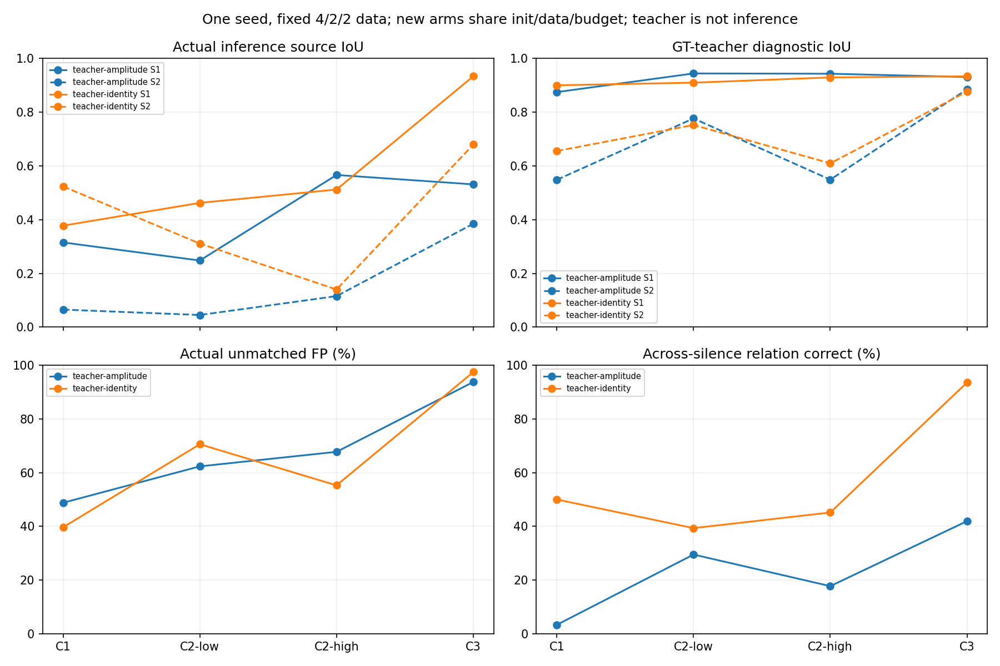
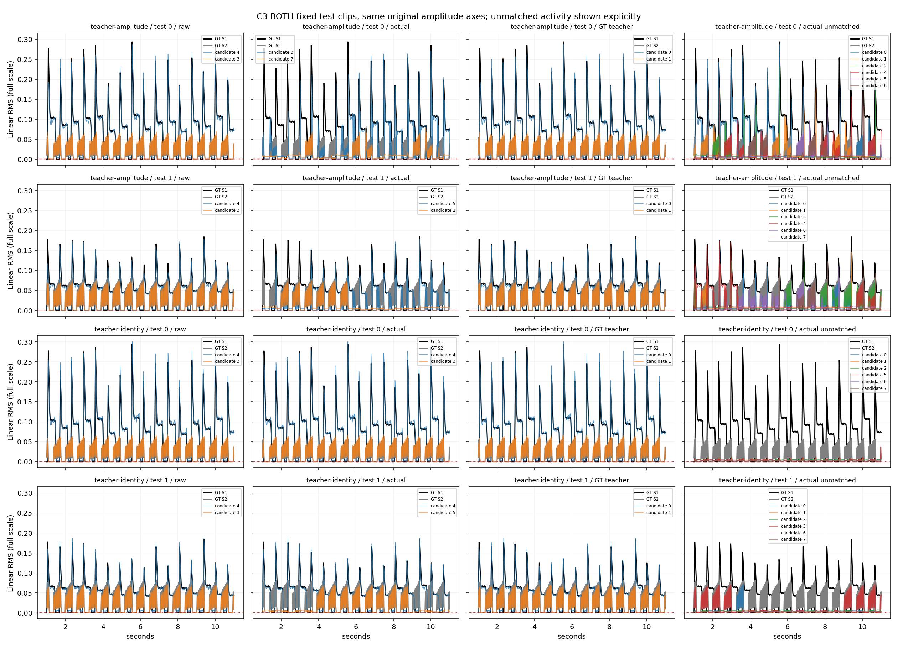

# #51 真值教师排列与直接身份监督：改善连接，集合验收仍失败

2026-10-05。完成用户选定的“真值包络辅助对应→直接身份监督→预测身份推理”实验，
冻结 SSAST Frame 与完整 197 token/2s 输入。两条新线在相同起点、课程、抽样和预算下比较：
直接身份监督提高 C3 实际 IoU 与静音后对应，但没有控制多余候选，也没有保持旧课程效果。
新方法尚未通过匿名来源分离验收；不启动 C4、不合并 draft PR #52。

## 实验边界与实现

用户选择见[方案评论](https://github.com/guajun/anonymous-audio-tracks/issues/51#issuecomment-5981435673)，
执行前协议见[teacher-identity](../research/issue-51-teacher-identity.md)，
正式训练前[试跑与开始记录](https://github.com/guajun/anonymous-audio-tracks/issues/51#issuecomment-5981788404)。
原 C0、浅头与完整窗口深度证据保留；本轮不调整纵轴或重新扫描活动门限。

- 用户 Frame 权重 SHA256 `b82b0714d92ddfd9de2c535b459ad900dea85a50c810dc43086fc6ac7047f689`；
  166 键严格加载与时间/位置审计沿用 P0。原下载出处没有独立认证。
- 4 层 WindowVHead，689,920 参数，197 token 的中心/均值/标准差读出，RMS 旁路和
  train-only `r=.2591032087802887` 不变。GPU bfloat16 head，V/范数/损失 float32，TF32 开启。
- C0/C1/C2-low/C2-high/C3 缓存与历史标签/时间/RMS 相同，各 4/2/2；课程仍是固定 pad/pluck
  匿名两来源。C3 真值活动重叠比例约34%，不是 C4 或新音色泛化。
- 两线从**同一个旧 depth4 selected raw C1 checkpoint**开始，初始权重哈希一致。
  teacher-amplitude 直接身份系数 0；teacher-identity 系数 .2。除该系数外，训练与推理相同。
  C1 起点已经拟合过该课程，这是两线共有的 warm start；本轮没有重新做独立 C0 训练。
- 每阶段 50/50 旧/新整段 replay，抽样 seed4650..4653，AdamW lr.001/decay1e-4、clip1。
  验证每50更新，主要 checkpoint 评分为实际推理 source MAE/r + .1(1-meanIoU)
  + .1未匹配轨 meanA/r + .01声源数 MAE，全已见 val 等样本平均。教师和 test 不选 checkpoint。

教师在16帧/320ms片段上，根据候选模长与真实包络的 Huber、面积 IoU、真实静音和零轨成本，
求 8P1/8P2 精确动态规划排列；相邻块索引切换先验 .01，按真实活动连续权重缩放。
教师不读预测 E。置信为源换候选的 emission 边际成本差 `gap/(gap+.02)`，不把先验造成的
任意选择当成可靠真值。P 为 stop-gradient 硬一对一，G=PᵀP_next；零轨身份未定义。

幅度监督保留真实源 Huber(delta=.1)/.1 + .1areaIoU + .1真实零点 meanA + .1零轨 meanA，
均在 r 尺度；真实全零时跳过不能提供有效梯度的 IoU。所有候选接受模长监督。
只重排原候选，不做向量或幅度软平均。

直接身份损失为 margin .2 双向正/负 cosine 排序 + .05 正对拉近。正对跨度20..900ms，
负对为另一真实源在相应端点附近<=900ms的非零节点。四个节点的真实连续活动权重与
教师置信相乘开方，分母只用真实活动权重，低置信不会被归一化抵消。GT零不训练身份；
精确零预测没有方向。训练不设 .001 预测硬准入门限，C0没有异源负对，身份损失为0。

**实际推理只接收模型 V**：相邻8×8预测 cosine 乘连续幅度可靠度
`sqrt(a_prev/(a_prev+.01r) * a_next/(a_next+.01r))`，Hungarian 硬一对一合成轨迹。
没有 GT、历史替换、长期原型或软模长分摊；每帧总幅度守恒。不保证任意静音后重连。
固定 .001 仅用于报告活动/FP/数量等评估。教师连接单独列为诊断。

## 验证、试跑、预算与成本

29项 frontend/C0/课程/完整窗口/新教师身份验证通过。新验证覆盖片段可辨、复制歧义、
P/G一对一、低置信绝对减权、空轨近零的线性梯度、禁止相反向量平均假零、低于活动
评估门限的方向梯度、GT零身份权重、硬推理守恒与候选逐帧打乱。

训练集独立100更新试跑记录于[原始诊断](../../evidence/issue-51-teacher-pilot.json)，
未继承试跑权重。它验证了有限损失/梯度，却**没有改善已拟合幅度起点**：末次模长损失
.017007 高于起点 .014336，零轨平均模长从 .000952 升至 .023516（r尺度）。该训练片段
教师 IoU .970/.736，实际 .337/.139，静音后5/30对应正确；相邻100%不能证明来源保持。

正式两线四阶段各1000更新，共8000。全部 stop_reason=`max_updates`；达到上限时优先
记录预算停止，平台条件另存，不能称为收敛。teacher-amplitude 的 C1/C2-high 和
teacher-identity 的 C2-low 达到“10次无1%改善”条件，但也同时到1000上限。

| 线 | C1选中更新 | C2-low | C2-high | C3 | 各阶段含验证/保存总耗时 |
|---|---:|---:|---:|---:|---:|
| teacher-amplitude | 250 | 750 | 900 | 700 | 283.01s |
| teacher-identity | 700 | 250 | 700 | 950 | 283.22s |

两进程并发 GPU0；durable runner 从启动到确认两进程正常退出330.02s（约5.5min）。
这是缓存后预测头训练/诊断成本，不包括已有 SSAST 特征提取。没有使用 GPU1。
完整命令、PID、退出码、预算与更新历史见[执行状态](../../evidence/issue-51-teacher-suite-status.json)。

## 当前课程的固定 test 结果

以下为两条固定 test 片段等样本平均，IoU在原线性轴且不先gate。Actual 为预测身份推理；
Teacher 为使用 GT 的诊断。额外面积为未匹配轨总幅度面积/GT源总面积；FP为未匹配轨
超过固定 .001 的点比例。教师的高 IoU 不算实际推理成功。

| 线 | 课程 | Actual IoU A/B | Teacher IoU A/B | Actual余槽FP | 额外面积 | 数量MAE |
|---|---|---|---|---:|---:|---:|
| 幅度对照 | C1 | .3152/.0651 | .8751/.5486 | 48.79% | 1.149 | 3.679 |
| 幅度对照 | C2-low | .2479/.0450 | .9446/.7770 | 62.34% | 1.068 | 4.672 |
| 幅度对照 | C2-high | .5665/.1153 | .9435/.5491 | 67.75% | 1.256 | 4.393 |
| 幅度对照 | C3 | .5315/.3846 | .9312/.8855 | 93.75% | .899 | 6.182 |
| 直接身份 | C1 | .3777/.5237 | .9004/.6557 | 39.65% | .860 | 2.590 |
| 直接身份 | C2-low | .4625/.3112 | .9102/.7526 | 70.58% | .770 | 4.626 |
| 直接身份 | C2-high | .5122/.1399 | .9297/.6097 | 55.27% | .619 | 3.748 |
| 直接身份 | C3 | .9339/.6797 | .9339/.8771 | 97.44% | .322 | 6.229 |

C3 Actual MAE 为 .030543/.014143 → .004125/.007744，匹配源 MAE/r 为 .086233→.022903。
把匹配源与补零余槽一起计入八轨 MAE/r，为 .057112→.017847；未匹配轨平均幅度/r
为 .047405→.016161。这些下降与高活动FP并存，因为固定 .001 门限仍低于多数残余输出。
直接身份线第二源比教师低 .1974 IoU，MAE约2.9倍；第一源实际与教师基本一致。
该线 C3 val Actual/Teacher 都为 .9348/.8745，test 第二源仍失败；两条 test 不足以支持
泛化显著性。全部原始预测和两条 test 的同轴曲线保留，避免只看成功片段。

直接身份线 C3 的真实源静音 FP 是 99.28%/29.00%，余槽97.44%，数量 MAE6.229；
实际未匹配活动面积仍相当于 GT总面积的32.2%，160ms活动块复制诊断57.14%。
相较对照，额外面积和复制诊断下降，但超门限的小幅余槽更多。不能只用 FP比例断言
“大幅复制”，也不能因为匹配源 IoU漂亮就忽略集合失败。

## 教师歧义、身份对应与梯度

对应指标仅用于评估：检查同一教师源节点在预测轨迹中是否落到同一行。活动按 GT精确
非零定义（训练身份定义），不是旧报告的 .001 活动事件；静音后只数相邻真实事件端点
间距<=900ms。它不要求落到整段 PIT 的正确源行，不能取代整段源 IoU。

| C3 test诊断 | 幅度对照 | 直接身份 |
|---|---:|---:|
| 相邻正确（1330对） | 78.72% | 100% |
| 块边界正确（62对） | 100% | 100% |
| 静音后正确（62对） | 26/62 = 41.94% | 58/62 = 93.55% |
| 静音后GT/置信加权正确 | 38.17% | 94.31% |
| 活动节点教师平均置信 | .7420 | .8151 |
| 加权正对cosine | .5663 | .9988 |
| 加权异源cosine | -.0110 | -.2821 |
| 加权margin违例 | 19.85% | 0% |
| 非邻接/邻接全部身份正负对数 | 6360 | 6360 |
| 正对跨GT静音比例 | 35.34% | 35.34% |
| 正对跨候选槽比例 | 0% | 0% |

该教师在 C3 test 没有选出跨槽正对；片段固定排列与模型原有槽分工使监督较简单。
这支持当前固定槽方向在不同事件之间更稳定，不能证明训练已学会任意候选换槽后的
身份恢复。逐帧打乱候选的实际 MAE差为0验证推理排列等变性，也不能代替这种泛化证据。
58/62正确仍不足以保持第二源整段轨迹；一个错误连接可以导致后续片段落入另一行。
缺少 GT身份监督的静音节点与八槽全量竞争是后续需逐事件检查的假设，不作为已证实原因。

后验[四次错误逐事件审计](../../evidence/issue-51-teacher-gap-failures.json)复现58/62：
四次均在第二源起音处，教师候选仍为槽3，起音前一帧GT为0、预测模长
.000358/.000367/.000419/.000354，起音后约 .0370/.0434/.0421/.0427；
槽3相邻方向cosine分别 -.0907/-.3738/-.5131/-.2601，预测行发生变化。
test00末尾10.98s一次，test01在3.28/3.92/9.04s三次，事件间距.24–.26s。
这确认了错误连接的位置和低幅度方向突变；活动正负对分离没有约束真值静音时的方向，
而实际推理仍要在这些预测非零节点上选边。该审计没有修改门限、checkpoint或训练，
也没有单独验证修复方案。

置信和 cosine 全分布分位数、预测 edge gap、PIT gap、教师每块排列与边际差距保存于完整
JSON。C3 test 活动教师置信非零不代表教师无错误，只说明当前 emission 边际可区分。
复制/相同包络时置信归零的小验证仍通过。

训练记录直接 V 与共享投影梯度。直接身份 C3 的37个非C0抽样诊断中，未乘 .2 的身份
切向范数平均 .15036、径向7.38e-9；幅度径向 .08196、切向6.49e-9。共享投影身份范数
.03464、幅度 .26943，梯度 cosine 均值 -.01003。身份损失有实际方向梯度，不能根据其
数值小声称没有学习；也不能用接近0的平均cosine证明不存在局部冲突。
幅度对照也计算未用于优化的身份梯度作为诊断，系数仍是0，不能误读为其接受身份训练。

## 遗忘、增益与历史对照

直接身份线达到 C3 后，固定旧 test 的实际结果如下；完整每阶段/已见val/test矩阵在汇总。

| 旧课程 | 最终Actual IoU A/B | 余槽FP |
|---|---|---:|
| C0 | .7588 | 85.71% |
| C1 | .6966/.1556 | 91.88% |
| C2-low | .9235/.2490 | 91.62% |
| C2-high | .7095/.1927 | 92.38% |

C1第二源从当前阶段 .5237 降至最终 .1556；C0 val 余槽85.71%远超原1%门槛。
没有通过 C0 或完整课程集合验收。

仅将 V 和 y 在输出端同比缩放 .5/1/2、r与评估门限固定：直接身份 C3 IoU约
.9339/.6798、.9339/.6797、.9339/.6799，但余槽 FP80.09%/97.44%/98.82%，
数量MAE5.110/6.229/6.379。连续推理可靠度与固定阈值仍有尺度依赖；这不是重渲染音频
经过 SSAST/head 的输入增益泛化实验。归一化MAE仍除固定r，随输出增益变化应如实保留。

历史完整4层 raw C3 IoU .9252/.8807、余槽1.80%、额外面积.0423、数量MAE.4142；
历史soft-local为 .7964/.5386且集合失败。新直接身份对配对幅度线有改善，但第二源和
集合指标没有超过历史raw。旧raw不执行这次的预测身份连接，且匹配、训练/选择规则不同，
不能把这些历史差异作为直接身份损失的单独因果效应。

需修正旧解释：原来已有 .1 平均余槽幅度惩罚；线性惩罚的模长梯度不因近零自动消失；
soft-local可能把有效幅度分摊到多槽；100%FP不单独证明大幅复制；旧val只覆盖匹配源
MAE/IoU，没有独立空轨/数量项。这些修正不删除旧失败证据。

## 可复查证据与保存路径

- [汇总与完整遗忘](../../evidence/issue-51-teacher-identity-summary.json)、
  [原始幅度线](../../evidence/issue-51-teacher-amplitude-full.json.gz)、
  [原始身份线](../../evidence/issue-51-teacher-identity-full.json.gz)。
- [训练起点诊断](../../evidence/issue-51-teacher-initial-train.json.gz)、
  [执行/源代码/权重/预测hash审计](../../evidence/issue-51-teacher-execution-audit.json)、
  [静音后错误事件](../../evidence/issue-51-teacher-gap-failures.json)、
  [验证曲线](../../evidence/issue-51-teacher-validation.png)。
- 核对56个 NPZ 均有限、V形状8×128，硬连接总幅度最大误差5.96e-8；
  七个实际训练/关联源文件 SHA与提交文件一致，两个初始 checkpoint hash一致。
- 独立服务器 `/mnt/ssd/user/lgy/issue-51-ssast/runs/teacher-identity/fit-v1/` 保存
  两线每阶段 selected/last head、全部预测及日志；预测归档为
  `/mnt/ssd/user/lgy/issue-51-ssast/runs/teacher-identity/predictions.zip`。
  权重/缓存/归档不入git；主依赖与共享checkout未改。SciPy仅入独立研究依赖。

本轮完成了选定路线的实现、配对训练和证据交付。它提供“直接身份监督改善当前连接”
的单seed小样本证据，也明确记录了零轨、遗忘和实际/教师差距。未声称统计显著性、
未见音色泛化、SSAST相对RMS增益或达到预算即收敛。
