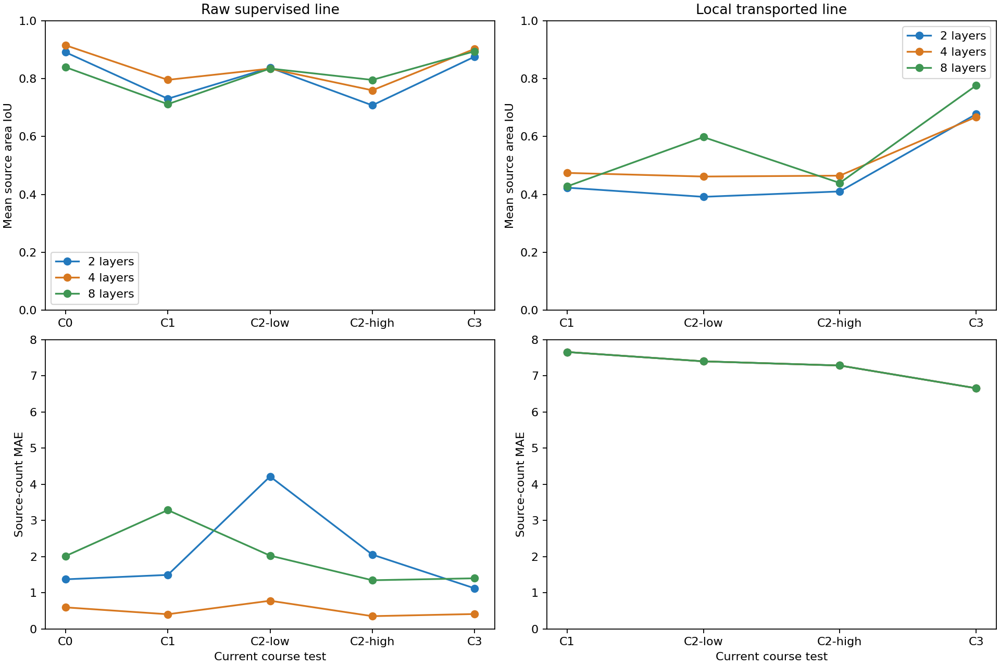
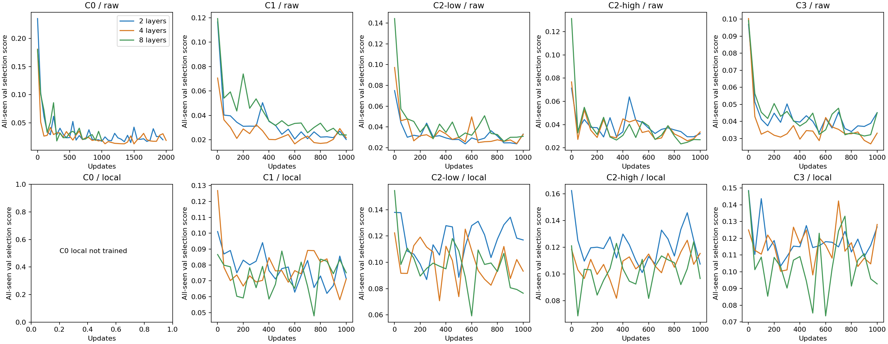
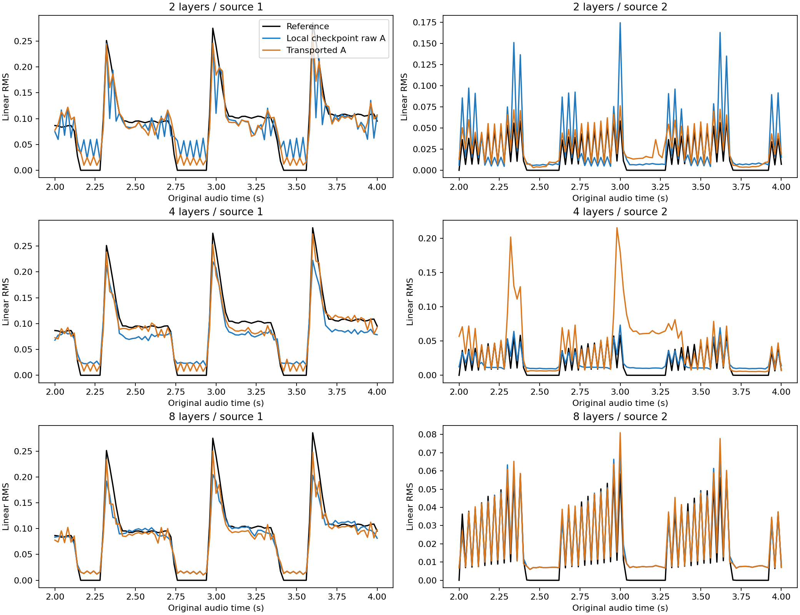

# #51 完整两秒读出与2/4/8层预测头对照

2026-10-04，冻结SSAST Frame，固定RMS旁路与原课程数据。三种深度均显式读取全部197个
时序token；全部C0/C1/C2-low/C2-high/C3对照、保存权重重评与原版GPU关联复核已完成。
8层在C2-low及C3的局部第二来源包络指标改善，但三种深度的局部线仍激活全部八个
候选，余槽误报和活动块复制比例均100%，尚未通过匿名来源集合/正确对应验收。

较长窗口统计区分音色仍是待验证假设。这次只测固定pad/pluck、4/2/2小样本和训练seed46，
不支持统计显著性或未见音色泛化；高度重叠的时间窗也不能作为独立统计样本数。
未开始C4，未合并draft PR。原[C0失败](issue-51-frame-c0.md)和
[浅头历史课程](issue-51-courses.md)均保留。

## 同一完整感受野下比较深度

三种头共用769→128投影、kernel3/stride1卷积与GELU，然后拼接中心98.25插值、
全窗口均值、全窗口标准差，输出K8×V128；A为V范数。最终读出直接依赖全部197个
token，输入窗口2s，token中心跨度1.96s。没有把“输入197但只输出局部中心”当成全窗口。

| 卷积层数 | 参数量 | 每个卷积位置的局部支持 | 中心两点插值的局部并集 | 最终直接读出 |
|---|---:|---:|---:|---:|
| 2 | 591,360 | 5 token | 6 token | 197 token / 2s |
| 4 | 689,920 | 9 token | 10 token | 197 token / 2s |
| 8 | 887,040 | 17 token | 18 token | 197 token / 2s |

深度比较中最终感受野一致；深度也增加参数量和局部混合半径，没有等参数量宽度对照。
历史浅头仅直接读取6 token，且预算、精度、初始化及执行后端不同，因此新旧差异不能
单独归因于窗口扩大。SSAST在历史浅头中已经有完整窗口注意力，本轮扩大的是头的直接读出。

执行方案先记录于[协议](../research/issue-51-window-depth.md)。新旧32个课程缓存的
数据索引、标签、时间轴与RMS完全一致，旧6 token对应子集最大差值为0，见
[缓存核对](../../evidence/issue-51-window-cache-audit.json)。全部课程中心1..11s真实2s输入
审计通过。音色、划分、loss、顺序、scale r=.2591032088、50/50 replay与整段PIT保持固定。

## 实际训练预算与成本

每种深度全窗口头从seed46随机初始化；C0 raw上限2000次，后续四个课程阶段
raw/local各上限1000次。验证每50更新，checkpoint由全部已见课程固定val选择；
最小1000更新后连续10次无1%改善的原早停逻辑保持。后续每个raw/local阶段均实际1000更新。
每阶段7200s安全上限没有触发。没有按test结果改参数或选checkpoint。

| 深度 | C0实际更新 | 后续raw总更新 | 后续local总更新 | 各阶段总耗时相加 |
|---|---:|---:|---:|---:|
| 2 | 1950 | 4000 | 4000 | 2319.5s / 38.7min |
| 4 | 2000 | 4000 | 4000 | 2353.6s / 39.2min |
| 8 | 1000 | 4000 | 4000 | 2392.3s / 39.9min |

C0三者都记录为验证停滞停止，4层在最大步同时满足停滞条件，8层在最小1000步停止。
C0实际更新并不完全相等，应结合验证曲线解释，不能将8层较低分当成能力上限。
三独立进程共用GPU0，总训练墙钟2437.2s，约40.6min；各阶段耗时包含验证和最终评估，
也含并发资源竞争，不能作为独立吞吐比较。保存权重重评85.5s、数值核对15.6s、
远端敏感性10.5s，另补原GPU全课程复核。逐阶段更新、选中更新与停止原因见
[完整表](../../evidence/issue-51-window-depth-tables.md)。原局部线30–39步短诊断没有覆盖。

## 当前课程Test结果

每对数字为两条来源的area IoU，等权平均两个当前课程test样本，固定整段一次PIT。
下表local采用训练执行优化版；原GPU函数全部选中局部checkpoint复核在所示精度一致。

| 阶段 | raw 2层 | raw 4层 | raw 8层 | local 2层 | local 4层 | local 8层 |
|---|---|---|---|---|---|---|
| C1 | .903/.558 | .911/.681 | .903/.520 | .759/.088 | .808/.141 | .766/.090 |
| C2-low | .936/.740 | .900/.770 | .915/.755 | .699/.084 | .755/.169 | .868/.328 |
| C2-high | .914/.502 | .923/.596 | .912/.680 | .760/.060 | .822/.107 | .767/.112 |
| C3 | .899/.853 | .925/.881 | .926/.863 | .769/.585 | .796/.539 | .790/.762 |

8层在C2-low及C3的第二源局部包络更好，C1/C2-high没有统一的深度排序。C3 raw 4层
余槽误报1.80%，2/8层为8.03%/16.63%；4层在一些集合指标更好，不能宣称越深越好。
原历史浅头C3 raw .937/.900、local .649/.447只是未匹配预算的参照。

| C3深度 | raw两源full-scale MAE | local两源full-scale MAE | local正确端点比例 |
|---|---|---|---|
| 2 | .00579/.00328 | .01537/.01319 | 0/.0625 |
| 4 | .00455/.00259 | .01304/.01652 | 0/.21875 |
| 8 | .00466/.00306 | .01448/.00578 | .4333/.4375 |

全部local课程的余槽误报和160ms活动块复制率都是100%，每源静音误报也是100%，
第二源漏报0来自恒有活动，不能判为成功。各深度local源数MAE完全相同：
C1 7.660、C2-low 7.402、C2-high 7.286、C3 6.659；下降来自真值活动密度增加，
不是预测八个槽逐渐变成两个。正确端点用真值做评估专用事件内对齐，不进入训练。

原C0 seed46 Val余槽4.87%失败不变。本轮新2/4/8层C0 Val余槽误报分别15.51%、
6.11%、27.79%，仍超过1%；其Test单源IoU为.891/.915/.840。C0每个test有99个padding
中心和401个完整中心，已单列MAE。这里padding区为真静音，IoU零值不作为活动拟合分数；
看幅值误差/误报，不把gate后静音0/0的实现约定误解为事件漏报。

原/搬运、gate前后、重叠/非重叠每源IoU及幅值误差、PIT并列、打乱、每源静音、
候选数量/复制、边界、正确端点和完整遗忘矩阵均在
[摘要JSON](../../evidence/issue-51-window-depth-summary.json)。
完整JSON用无损gzip保存为`evidence/issue-51-window-depth{2,4,8}-full.json.gz`；
全部原轴NPZ预测同时保留远程与本地忽略目录`runs/issue-51-window-predictions.zip`。

## 远端读出、执行数值与遗忘

统一保留90..107共18个中心token，覆盖最深8层中心卷积的全部依赖，分别替换远端token
或RMS为各窗口均值。CPU契约测试确认三深度中心卷积输出不变，全窗口统计量变化。
在两个C3 test上，替换远端SSAST token后raw归一化MAE增加范围为：2层.01756–.02840、
4层.03049–.04287、8层.04134–.05711。远端信息实际影响预测；这项非真实分布扰动
不能证明音色身份、SSAST相对RMS增益或泛化，见[敏感性记录](../../evidence/issue-51-window-context-sensitivity.json)。

训练在CPU执行原已离散的最新真实参考选择，GPU批量计算可微C→A，过去真实E梯度保留。
20项测试通过，包括197位置梯度、共同中心保护区、CPU/GPU小样例输出/梯度容差。
实际样本核对发现并非逐帧等价：附加在4层raw头上的关联诊断最大C差.125、幅值差.03186，
归一化MAE差最大.000611；主raw评估本来不搬运A。正式C3 local最大幅值差.001375，
归一化MAE绝对差7.10e-6，fragment IDs一致。小样例通过不是全数据等价证明。

因此另用原GPU选择器复核所有12个选中local checkpoint的全部已见val/test，不训练、不
重新选权重；C3原GPU IoU依次.76946/.58517、.79640/.53864、.79026/.76221，
余槽100%与正确端点比例结论保持。两套评估分别保存在
[原GPU摘要](../../evidence/issue-51-window-original-reference-summary.json)、
`evidence/issue-51-window-original-reference-full.json.gz`和
[执行审计](../../evidence/issue-51-window-execution-audit.json)。训练中近并列的数值选取差异
不能靠保存权重复核排除，应计入与历史浅头比较的限制。

Replay没有消除遗忘：C3末端raw C0 IoU为.905/.898/.865，local C0为.704/.725/.699。
4层raw C2-high第二源由当前阶段.596降至最终.537；4层local C2-low第二源由.169降至.042。
旧课程完整矩阵没有挑选对各旧课程分别最好的一次权重，均取阶段统一val-selected checkpoint。

以下图均为各深度local checkpoint：蓝为它的raw A，橙为transported A，黑为分轨真值。
蓝线不代表上表独立raw训练线，纵轴每源保留实际尺度。

本轮完成用户指定完整窗口与深度对照，观察到部分包络改善，保持局部集合/身份失败结论。
统计时序区分音色与瞬态更易学仍需独立数据轴/多seed证据；当前不加来源数或宣称分离成功。
